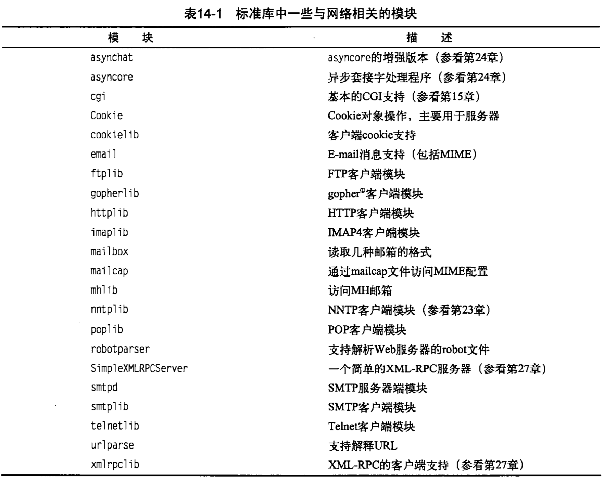

## 第十四章 网络编程

相关的一些模块索引：

与windows网络编程概念概念一致，都是基于sockte api

> 创建服务端代码

    # coding=utf-8

    import socket

    server = socket.socket();

    hostname = socket.gethostname()
    port = 9979

    server.bind(('127.0.0.1',port))
    server.listen(5)

    print 'server is started.'

    while True:
        client,addr = server.accept()

        print 'got a client'+str(addr)

        client.send('thx you connect,byebye')
        client.close()

> 创建客户端代码

    # coding=utf-8

    import socket

    client = socket.socket()
    hostname = socket.gethostname()

    client.connect(('127.0.0.1',9979))

    print client.recv(2014)

#### 强大的网络模块 urllib与urllib2

这两个模块可以将网络地址像本地文件一样打开，一个小例子：

    from urllib import urlopen
    webpack = urlopen('http://www.baidu.com')
    data = webpack.readlines()
    print data

    # 另外一个保存网页的栗子：
    webpack = urllib.urlopen('http://www.baidu.com')
    data = webpack.readlines()
    fp = open('/Users/ran/Desktop/testfile','w')
    for line in data:
        fp.write(line)
        # print line
    fp.flush()
    fp.close()

> 将文件下载到本地

    # 将网络文件下载到本地
    urllib.urlretrieve('http://www.baidu.com','/Users/ran/Desktop/baidu.html')
    # 这个函数返回了一个元组（文件名，header）header含有远程文件的一些信息

#### socket 服务端编写

搜索关键字： socketServer、fork模式 多线程模式 异步io

