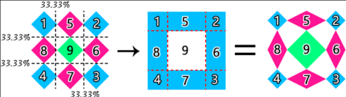

<!-- START doctoc generated TOC please keep comment here to allow auto update -->
<!-- DON'T EDIT THIS SECTION, INSTEAD RE-RUN doctoc TO UPDATE -->


- [CSS3 边框 颜色 文字 背景](#css3-%E8%BE%B9%E6%A1%86-%E9%A2%9C%E8%89%B2-%E6%96%87%E5%AD%97-%E8%83%8C%E6%99%AF)
  - [CSS3 边框 圆角效果 border-radius](#css3-%E8%BE%B9%E6%A1%86-%E5%9C%86%E8%A7%92%E6%95%88%E6%9E%9C-border-radius)
  - [CSS3 边框 阴影 box-shadow（一）](#css3-%E8%BE%B9%E6%A1%86-%E9%98%B4%E5%BD%B1-box-shadow%E4%B8%80)
  - [CSS3 边框 阴影 box-shadow（二）](#css3-%E8%BE%B9%E6%A1%86-%E9%98%B4%E5%BD%B1-box-shadow%E4%BA%8C)
  - [CSS3 边框 为边框应用图片 border-image](#css3-%E8%BE%B9%E6%A1%86-%E4%B8%BA%E8%BE%B9%E6%A1%86%E5%BA%94%E7%94%A8%E5%9B%BE%E7%89%87-border-image)
    - [border-image-slice 边框裁剪线](#border-image-slice-%E8%BE%B9%E6%A1%86%E8%A3%81%E5%89%AA%E7%BA%BF)
  - [CSS3 颜色 颜色之 RGBA](#css3-%E9%A2%9C%E8%89%B2-%E9%A2%9C%E8%89%B2%E4%B9%8B-rgba)
  - [CSS3 颜色 渐变色彩](#css3-%E9%A2%9C%E8%89%B2-%E6%B8%90%E5%8F%98%E8%89%B2%E5%BD%A9)
  - [CSS3 文字与字体 嵌入字体@font-face](#css3-%E6%96%87%E5%AD%97%E4%B8%8E%E5%AD%97%E4%BD%93-%E5%B5%8C%E5%85%A5%E5%AD%97%E4%BD%93font-face)
  - [CSS3 文字与字体 文本阴影 text-shadow](#css3-%E6%96%87%E5%AD%97%E4%B8%8E%E5%AD%97%E4%BD%93-%E6%96%87%E6%9C%AC%E9%98%B4%E5%BD%B1-text-shadow)
  - [CSS3 背景 background-origin](#css3-%E8%83%8C%E6%99%AF-background-origin)
  - [CSS3 背景 background-clip](#css3-%E8%83%8C%E6%99%AF-background-clip)
  - [CSS3 背景 background-size](#css3-%E8%83%8C%E6%99%AF-background-size)
  - [CSS3 背景 multiple backgrounds [多重背景]](#css3-%E8%83%8C%E6%99%AF-multiple-backgrounds-%E5%A4%9A%E9%87%8D%E8%83%8C%E6%99%AF)
  - [使用渐变作为背景](#%E4%BD%BF%E7%94%A8%E6%B8%90%E5%8F%98%E4%BD%9C%E4%B8%BA%E8%83%8C%E6%99%AF)

<!-- END doctoc generated TOC please keep comment here to allow auto update -->

# CSS3 边框 颜色 文字 背景

## CSS3 边框 圆角效果 border-radius

border-radius 是向元素添加圆角边框

```
border-radius:10px; /* 所有角都使用半径为10px的圆角 */
border-radius: 5px 4px 3px 2px;
/* 四个半径值分别是左上角、右上角、右下角和左下角，顺时针 */
```

_Tips:不要以为 border-radius 的值只能用 px 单位，你还可以用百分比或者 em，但兼容性目前还不太好_

> 实心上半圆

方法：把高度(height)设为宽度（width）的一半，并且只设置左上角和右上角的半径与元素的高度一致（大于也是可以的）。

```
div{
	height:50px;/*是width的一半*/
	width:100px;
	background:#9da;
	border-radius:50px 50px 0 0;/*半径至少设置为height的值*/
}
```

> 实心圆

方法：把宽度（width）与高度(height)值设置为一致（也就是正方形），并且四个圆角值都设置为它们值的一半。如下代码：

```
div{
	height:100px;/*与width设置一致*/
	width:100px;
	background:#9da;
	border-radius:50px;/*四个圆角值都设置为宽度或高度值的一半*/
}
```

## CSS3 边框 阴影 box-shadow（一）

box-shadow 是向盒子添加阴影。支持添加一个或者多个。

    box-shadow: X轴偏移量 Y轴偏移量 [阴影模糊半径] [阴影扩展半径] [阴影颜色] [投影方式];

参数介绍：


**注意：inset 可以写在参数的第一个或最后一个，其它位置是无效的**

> 为元素设置外阴影

```
.box_shadow{
  box-shadow:4px 2px 6px #333333;
}
```

> 为元素设置内阴影

```
.box_shadow{
  box-shadow:4px 2px 6px #333333 inset;
}
```

> 添加多个阴影

```
.box_shadow{
    box-shadow:4px 2px 6px #f00, -4px -2px 6px #000, 0px 0px 12px 5px #33CC00 inset;
}
```

## CSS3 边框 阴影 box-shadow（二）

> 阴影模糊半径与阴影扩展半径的区别

阴影模糊半径：此参数可选，其值只能是为正值，如果其值为 0 时，表示阴影不具有模糊效果，其值越大阴影的边缘就越模糊

阴影扩展半径：此参数可选，其值可以是正负值，如果值为正，则整个阴影都延展扩大，反之值为负值时，则缩小；

> X 轴偏移量和 Y 轴偏移量值可以设置为负数

    box-shadow: X轴偏移量 Y轴偏移量 [阴影模糊半径] [阴影扩展半径] [阴影颜色] [投影方式];

坐标元素为左上角，X 正方向向右，Y 正方向向下

## CSS3 边框 为边框应用图片 border-image

顾名思义就是为边框应用背景图片，它和我们常用的 background 属性比较相似。例如：

    background:url(xx.jpg) 10px 20px no-repeat;

根据 border-image 的语法：：


### border-image-slice 边框裁剪线

数字依次表示上右下左的边框裁剪线距离该方向图片边缘的距离是多少，fill 表示图片中心参不参与填充，一般是不参与的；裁剪完毕后，九宫格的粉色部分用作边框线的重复填充，蓝色部分用于边角填充。

裁剪的九宫格示意图：



```css
border-image-slice: 10 20 25 30;
border-image-slice: 10 20% 25 30;
border-image-slice: 10 20 25 30 fill;
```

## CSS3 颜色 颜色之 RGBA

    color：rgba(R,G,B,A)

## CSS3 颜色 渐变色彩

CSS3 Gradient 分为线性渐变(linear)和径向渐变(radial)。

语法：linear-gradient(方向,颜色，颜色...)

> 线性渐变


参数：

渐变方向可以用“角度”的关键词或“英文”来表示：


_第一个参数省略时，默认为“180deg”，等同于“to bottom_

第二个和第三个参数，表示颜色的起始点和结束点，可以有多个颜色值。

```
background-image:linear-gradient(to top left,red,yellow,blue,black);
```

> CSS3 文字与字体 text-overflow 与 word-wrap

text-overflow 用来设置是否使用一个省略标记（...）标示对象内文本的溢出。

语法：

    text-overflow：clip[裁断]|ellipse[省略号]

word-wrap 也可以用来设置文本行为，当前行超过指定容器的边界时是否断开转行。

语法：

    word-wrap:normal|break-word[连续文本阶段|强制截断]

## CSS3 文字与字体 嵌入字体@font-face

@font-face 能够加载服务器端的字体文件，让浏览器端可以显示用户电脑里没有安装的字体。

```
//定义
@font-face{
	font-family:font-lssb;
	src:url('../font/lssb.ttf');
}
//使用
font-family: "font-lssb","微软雅黑";
```

## CSS3 文字与字体 文本阴影 text-shadow

    text-shadow: X-Offset Y-Offset blur color;

X-Offset：表示阴影的水平偏移距离，其值为正值时阴影向右偏移，反之向左偏移；

Y-Offset：是指阴影的垂直偏移距离，如果其值是正值时，阴影向下偏移，反之向上偏移；

Blur：是指阴影的模糊程度，其值不能是负值，如果值越大，阴影越模糊，反之阴影越清晰，如果不需要阴影模糊可以将 Blur 值设置为 0；

Color：是指阴影的颜色，其可以使用 rgba 色。

    text-shadow: 0px 0px 5px red;

## CSS3 背景 background-origin

设置元素背景图片的原始起始位置

    background-origin ： border-box | padding-box | content-box;

参数分别表示背景图片是从边框，还是内边距（默认值），或者是内容区域开始显示。

**需要注意的是，如果背景不是 no-repeat，这个属性无效，它会从边框开始显示。**

## CSS3 背景 background-clip

参数分别表示从边框、或内填充，或者内容区域向外裁剪背景。no-clip 表示不裁切，和参数 border-box 显示同样的效果。backgroud-clip 默认值为 border-box。

## CSS3 背景 background-size

设置背景图片的大小，以长度值或百分比显示，还可以通过 cover 和 contain 来对图片进行伸缩。

    background-size: auto | <长度值> | <百分比> | cover | contain

取值说明：

1、auto：默认值，不改变背景图片的原始高度和宽度；

2、<长度值>：成对出现如 200px 50px，将背景图片宽高依次设置为前面两个值，**当设置一个值时，将其作为图片宽度值来等比缩放**；

3、<百分比>：0％~100％之间的任何值，将背景图片宽高依次设置为所在元素宽高乘以前面百分比得出的数值，当设置一个值时同上；

4、cover：顾名思义为覆盖，即将背景图片等比缩放以填满整个容器；

5、contain：容纳，即将背景图片等比缩放至某一边紧贴容器边缘为止。

## CSS3 背景 multiple backgrounds [多重背景]

缩写时为用逗号隔开的每组值；用分解写法时，如果有多个背景图片，而其他属性只有一个（例如 background-repeat 只有一个），表明所有背景图片应用该属性值。

```
background-image: url(http://img.mukewang.com/54cf2365000140e600740095.jpg),
                  url(http://img.mukewang.com/54cf238a0001728d00740095.jpg),
                  url(http://img.mukewang.com/54cf23b60001fd9700740096.jpg);
background-position: left top, 100px 0, 200px 0;
background-repeat: no-repeat,no-repeat,no-repeat;

 background:
 url(http://static.mukewang.com/static/img/logo_index.png) no-repeat left top,
 url(http://static.mukewang.com/static/img/logo_index.png) no-repeat 150px 0;
```

## 使用渐变作为背景

```
/*使用伪元素制作导航列表项分隔线*/
		.nav li{background:linear-gradient(to bottom,#dd2926,#a82724,#dd2926) no-repeat right / 1px 15px;}
//指定背景位置时，如果背景带有size属性，需要使用/并紧跟position后，宽、高
```
