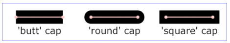
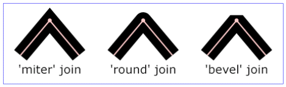

<!-- START doctoc generated TOC please keep comment here to allow auto update -->
<!-- DON'T EDIT THIS SECTION, INSTEAD RE-RUN doctoc TO UPDATE -->
**Table of Contents**  *generated with [DocToc](https://github.com/thlorenz/doctoc)*

- [使用 CSS 属性控制 SVG 绘制](#%E4%BD%BF%E7%94%A8-css-%E5%B1%9E%E6%80%A7%E6%8E%A7%E5%88%B6-svg-%E7%BB%98%E5%88%B6)
- [需要注意的 SVG CSS 属性](#%E9%9C%80%E8%A6%81%E6%B3%A8%E6%84%8F%E7%9A%84-svg-css-%E5%B1%9E%E6%80%A7)
  - [一个环形进度条实现](#%E4%B8%80%E4%B8%AA%E7%8E%AF%E5%BD%A2%E8%BF%9B%E5%BA%A6%E6%9D%A1%E5%AE%9E%E7%8E%B0)
  - [路径端点、转折点设置标记](#%E8%B7%AF%E5%BE%84%E7%AB%AF%E7%82%B9%E8%BD%AC%E6%8A%98%E7%82%B9%E8%AE%BE%E7%BD%AE%E6%A0%87%E8%AE%B0)

<!-- END doctoc generated TOC please keep comment here to allow auto update -->

## 使用 CSS 属性控制 SVG 绘制

```html
<!-- 圆角矩形 -->
<svg>
  <rect class="rect"></rect>
</svg>
<!-- 定义Path -->
<svg>
<path class="diamond">
</svg>
```

```css
.rect {
  x: 30px;
  y: 15px;
  width: 240px;
  height: 120px;
  rx: 10px;
  ry: 10px;
}
.diamond {
  d: path("M150 10L240 75L150 140L60 75");
}
```

场景：

- 增强了复用性
- 通过外部手段重置 SVG 设置成为可能
- SVG 的动画效果实现更方便了

## 需要注意的 SVG CSS 属性

- fill-opacity：设置填充颜色或者填充图像的透明度
- fill-rule：路径填充规则（非零环绕、奇偶填充）
- stroke-linecap：路径端点表现形式，butt（默认值）、round 和 square；只有在开放路径中才能看到效果



- stroke-linejoin：描边转角的表现方式，可用值有 miter（默认值）、round 和 bevel



- stroke-miterlimit：描边相交形成的锐角的表现方式，默认大小是 4。锐角形成的间距小于 4 的位置表现为平角，不再显示为锐角；stroke-miterlimit 属性只有在 strokelinejoin 属性值是 miter 的时候才有效，同时 stroke-miterlimit 的属性值越大，锐角的损耗就越大
- stroke-opacity 属性表示描边透明度，默认属性值是 1，范围是 0 ～ 1。尽量不要使用百分比值，因为 IE 浏览器和 Edge 浏览器并不支持
- stroke-dasharray 属性用于描述描边线：语法：&lt;实色长度、透明长度、实色长度、透明长...不断重复&gt;，因此可以用它来实现非常丰富的点线效果
- stroke-dashoffset 属性用于控制描边渲染的路径偏移距离：用于绘制路径动画非常好用；如果偏移距离足够大，描边就会看不见；如果偏移为 0，描边就会完整显示（描边路径动画）
- paint-order：可以调整描边、填充、markers 的渲染顺序（默认顺序是填充->描边->mark），实现 SVG 外描边的时候比较有用
- vector-effect：控制描边是否跟随 SVG 缩放进行等比缩放（设置了 viewBox 属性的 SVG 元素中的 stroke 描边默认会跟随 SVG 尺寸的变化而变化），如果需要让描边始终保持固定的边线宽度，可以使用这个属性完成（vector-effect:non-scaling-stroke）
- text-anchor：SVG 设置文字居中对齐（其实是设置文字块与 SVG 块定位点的对齐方式，假设 SVG 文字块定位在(x,y)的位置，则只需要让文字块的 x 中心点与(x,y)对齐即可实现居中对齐的效果）
- dominant-baseline：文字垂直居中对齐（baseline、middle 和 hanging 这 3 个值就够用了）
- alignment-baseline：如果一段文字中有字体大小不一样的情况，对齐的时候可以用的上

**针对 stroke-dashoffset 说明：这个偏移是相对于正常渲染的路径描边线而言的偏移，正值相当于把路径端点向前移，会导致路径尾巴出现空白，负值则相当于后移，会导致路径头部出现空白**

**Tips：如果需要使用 stroke-dashoffset 实现路径动画，需要配合 stroke-dasharray 设置路径点线长度，否则会没有效果**

### 一个环形进度条实现

其中的 1069px 是圆环的周长，使用公式 Length = Math.PI \* R \* 2 计算得来（圆的半径为 170）。由于圆形描边是从 3 点钟方向开始的，因此第二个&lt;circle&gt;元素设置了 `transform="rotate(-90 220 220)"`逆时针旋转 90 度让描边从圆的顶部开始

```html
<svg width="440" height="440" viewBox="0 0 440 440">
  <!-- 渐变定义 -->
  <defs>
    <linearGradient x1="1" y1="0" x2="0" y2="0" id="gradient">
      <stop offset="0%" stop-color="#e52c5c"></stop>
      <stop offset="100%" stop-color="#ab5aea"></stop>
    </linearGradient>
  </defs>
  <!-- 进度条底槽 -->
  <circle cx="220" cy="220" r="170" class="circle-track"></circle>
  <!-- 进度条进度 -->
  <circle
    cx="220"
    cy="220"
    r="170"
    transform="rotate(-90 220 220)"
    class="circle-bar"
    style="stroke-dashoffset: 897.96px; transition: all 0.3s ease 0s;"
  ></circle>
  <text
    class="text"
    x="50%"
    y="50%"
    dominant-baseline="middle"
    text-anchor="middle"
  >
    16%
  </text>
</svg>
```

如果是不规则路径可以使用下面的方式获取路径长度，然后设置到 stroke-dashoffset 上：

```js
var path = document.querySelector("path");
var length = path.getTotalLength();
```

### 路径端点、转折点设置标记

- marker-start（端点开始标记）
- marker-end（端点结束标记）
- marker-mid（折线连接点的填充标记）
