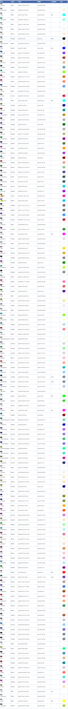

<!-- START doctoc generated TOC please keep comment here to allow auto update -->
<!-- DON'T EDIT THIS SECTION, INSTEAD RE-RUN doctoc TO UPDATE -->
**Table of Contents**  *generated with [DocToc](https://github.com/thlorenz/doctoc)*

- [CSS Level 4 下支持的全部色值](#css-level-4-%E4%B8%8B%E6%94%AF%E6%8C%81%E7%9A%84%E5%85%A8%E9%83%A8%E8%89%B2%E5%80%BC)
- [CSS 与 SVG、Canvas 渲染的差异](#css-%E4%B8%8E-svgcanvas-%E6%B8%B2%E6%9F%93%E7%9A%84%E5%B7%AE%E5%BC%82)
  - [解决办法](#%E8%A7%A3%E5%86%B3%E5%8A%9E%E6%B3%95)
- [currentColor](#currentcolor)
- [HSL 简单记忆](#hsl-%E7%AE%80%E5%8D%95%E8%AE%B0%E5%BF%86)

<!-- END doctoc generated TOC please keep comment here to allow auto update -->

## CSS Level 4 下支持的全部色值

## CSS 与 SVG、Canvas 渲染的差异

CSS 中半透明到不透明的过渡算法仅计算 Alpha 通道，不会变动色值部分，而 SVG、Canvas 中色值部分是会参与渐变的差值运算的，这可能会导致中间颜色并不符合你的预期

### 解决办法

在 SVG、Canse 中不要使用 transparent 关键字，而使用完整的颜色描述，并且色值部分（除了 Alpha 通道外的部分），起始点与终止点的颜色设置成一样的，就可以规避这个问题了

## currentColor

指代当前元素的 color 属性值，SVG、box-shadow 等 CSS 属性可以轻松借助这个关键字进行泛用性很强的颜色控制且无可替代

## HSL 简单记忆

- red=0deg、green=120deg、blue=240deg
- 饱和度和亮度的值是任意的，最终解析的数值范围均在 0%-100%，数值后面的百分号一定不能少，否则整个语句无效
