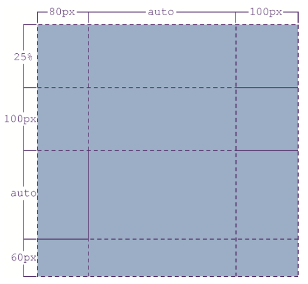

<!-- START doctoc generated TOC please keep comment here to allow auto update -->
<!-- DON'T EDIT THIS SECTION, INSTEAD RE-RUN doctoc TO UPDATE -->
**Table of Contents**  *generated with [DocToc](https://github.com/thlorenz/doctoc)*

- [Grid 布局](#grid-%E5%B8%83%E5%B1%80)
    - [属性索引](#%E5%B1%9E%E6%80%A7%E7%B4%A2%E5%BC%95)
  - [Grid 行列布局基础（grid-template-columns、grid-template-rows）](#grid-%E8%A1%8C%E5%88%97%E5%B8%83%E5%B1%80%E5%9F%BA%E7%A1%80grid-template-columnsgrid-template-rows)
  - [行列布局进阶（命名）](#%E8%A1%8C%E5%88%97%E5%B8%83%E5%B1%80%E8%BF%9B%E9%98%B6%E5%91%BD%E5%90%8D)
    - [track-size 的取值](#track-size-%E7%9A%84%E5%8F%96%E5%80%BC)
    - [混合使用 auto](#%E6%B7%B7%E5%90%88%E4%BD%BF%E7%94%A8-auto)
  - [fit-content 函数](#fit-content-%E5%87%BD%E6%95%B0)
  - [repeat 函数](#repeat-%E5%87%BD%E6%95%B0)
    - [repeat()函数可以与长度值和百分比值一起使用](#repeat%E5%87%BD%E6%95%B0%E5%8F%AF%E4%BB%A5%E4%B8%8E%E9%95%BF%E5%BA%A6%E5%80%BC%E5%92%8C%E7%99%BE%E5%88%86%E6%AF%94%E5%80%BC%E4%B8%80%E8%B5%B7%E4%BD%BF%E7%94%A8)
    - [auto-fil 与 auto-full 的区别](#auto-fil-%E4%B8%8E-auto-full-%E7%9A%84%E5%8C%BA%E5%88%AB)
    - [兼容性](#%E5%85%BC%E5%AE%B9%E6%80%A7)
  - [隐式网格声明](#%E9%9A%90%E5%BC%8F%E7%BD%91%E6%A0%BC%E5%A3%B0%E6%98%8E)
  - [Grid 缩写](#grid-%E7%BC%A9%E5%86%99)
  - [网格线命名](#%E7%BD%91%E6%A0%BC%E7%BA%BF%E5%91%BD%E5%90%8D)
  - [网格间距 Gap](#%E7%BD%91%E6%A0%BC%E9%97%B4%E8%B7%9D-gap)
  - [非常重要的各种对齐属性](#%E9%9D%9E%E5%B8%B8%E9%87%8D%E8%A6%81%E7%9A%84%E5%90%84%E7%A7%8D%E5%AF%B9%E9%BD%90%E5%B1%9E%E6%80%A7)
    - [容器对齐控制](#%E5%AE%B9%E5%99%A8%E5%AF%B9%E9%BD%90%E6%8E%A7%E5%88%B6)
    - [项目对齐控制](#%E9%A1%B9%E7%9B%AE%E5%AF%B9%E9%BD%90%E6%8E%A7%E5%88%B6)
    - [缩写](#%E7%BC%A9%E5%86%99)
  - [网格项目属性](#%E7%BD%91%E6%A0%BC%E9%A1%B9%E7%9B%AE%E5%B1%9E%E6%80%A7)
    - [简写（grid-area）](#%E7%AE%80%E5%86%99grid-area)
    - [简写（grid-column 与 grid-row）](#%E7%AE%80%E5%86%99grid-column-%E4%B8%8E-grid-row)
  - [网格合并 span 语法](#%E7%BD%91%E6%A0%BC%E5%90%88%E5%B9%B6-span-%E8%AF%AD%E6%B3%95)

<!-- END doctoc generated TOC please keep comment here to allow auto update -->

# Grid 布局

### 属性索引

| 作用在容器上的        | 作用在子项上的    |
| --------------------- | ----------------- |
|                       |                   |
| grid-template-columns | grid-column-start |
| grid-template-rows    | grid-column-end   |
| grid-template-areas   | grid-row-start    |
| grid-template         | grid-row-end      |
| grid-column-gap       | grid-column       |
| grid-row-gap          | grid-row          |
| grid-gap              | grid-area         |
| justify-items         | justify-self      |
| align-items           | align-self        |
| place-items           | place-self        |
| justify-content       |                   |
| align-content         |                   |
| place-content         |                   |
| grid-auto-columns     |                   |
| grid-auto-rows        |                   |
| grid-auto-flow        |                   |
| grid                  |                   |

## Grid 行列布局基础（grid-template-columns、grid-template-rows）

基础样例：

```css
.container {
  grid-template-columns: 80px auto 100px;
  grid-template-rows: 25% 100px auto 60px;
}
/* 缩写形式 */
.container {
  /* 先行后列 */
  grid-template: 25% 100px auto 60px / 80px auto 100px;
  /* 这样也是可以的 */
  grid: 25% 100px auto 60px / 80px auto 100px;
}
```

效果:



## 行列布局进阶（命名）

基础语法：`grid-template-columns: <line-name> <track-size> ...;`,grid-template-rows 与 columns 一样，命名还可以更加精细化的命名：

```css
.container {
  grid-template-columns:
    [广告区-左] 120px [广告区-右 内容区-左]
    600px [内容区-右];
}
```

### track-size 的取值

_Tips:justify-content 和 min-width/max-width 可以改变元素的尺寸上下限_

- min-content：所有列中最大的那个最小内容宽度（如果 min-width 更大，则使用 min-width）
- max-content：所有列中最大的那个最大内容宽度
- auto：根据 max-content、justify-content、元素最小宽度、min-width 联合计算元素宽度
- fr：是 fraction 的缩写，与 flex 的权重表现基本一样：如果总和超过 1，则按比例分配宽度，如果总和小于 1，则元素宽度等于剩余可分配宽度乘以设置的 fr 数值（最终的宽度会小于容器宽度，有留白）
- 固定尺寸：100px，其他自动计算的宽度都是在减去固定宽度之后计算的
- minmax(min,max)：表示尺寸范围限制在 min ~ max 范围内（以 fr 为单位的值，只能作为第二个参数出现）
- fit-content：尺寸由内容决定，内容越多尺寸越大，但不超过限定的尺寸
- repeat：组合使用 minmax、fit-content、fr 的简写

### 混合使用 auto

fr 值的可自动分配尺寸是容器尺寸减去设置 auto 关键字的列的 fit-content 尺寸,然后按照 fr 的规则去分配，设置 fr 的列分配完成后，剩余的尺寸再交给 auto 列走 auto 的计算规则进行分配

## fit-content 函数

整体表现就是：尺寸由内容决定，内容越多尺寸越大，但不超过限定的尺寸，不支持 fr

语法：`fit-content( [ <length> | <percentage> ] )`

计算公式：`fit-content(limit) = max(minimum, min(limit, max-content))`

- minimum：是尺寸下限，如果不考虑 min-width/minheight 属性，这个尺寸就是最小内容尺寸
- max-content：最大内容宽度

> 事实上，fit-content()函数的表现和 fit- content 关键字的表现都是一样的，fit-content 的尺寸表现也是宽度随着内容变化，但是尺寸最大不超过包含块（通常是父元素）的尺寸。但在网格布局中，往往多项并存，多个元素共享一个包含块元素，因此 fitcontent 尺寸是没有任何意义的，只能通过参数限制尺寸的上限，于是才有了 fit-content()函数

## repeat 函数

语法：`repeat( [ <positive-integer> | auto-fill | auto-fit ] , <tracklist> )`

auto-fill 和 auto-fit 相当于一个变量，表示一个不确定的重复次数，究竟重复多少次，是由 grid 容器和每一个 grid 子项的尺寸计算得到的

### repeat()函数可以与长度值和百分比值一起使用

应用场景比较少，样例代码：

```css
.container {
  /* 有效：倒数第二列100px宽、倒数第一列宽度为20% */
  grid-template-columns: repeat(auto-fill, minmax(100px, 1fr)) 100px 20%;
}
```

### auto-fil 与 auto-full 的区别

- auto-fit：所有的子元素以及间距将会占据全部剩余空间（符合常规布局表现、元素效果优先）
- auto-full：子元素不会占据全部的剩余空间，相反，Grid 网格将会尽可能的将剩余空间与现有元素综合起来尽可能的将网格空间容纳尽可能多的格子，然后将子元素容纳进去，剩余空间则放置空盒子

### 兼容性

在 Firefox 浏览器中，grid-template-rows 属性对 repeat()函数仅仅是部分支持，**不支持的是 auto-fill 和 auto-fit 这两个关键字参数**，grid-template-columns 属性对 repeat()函数则是完全支持的。

## 隐式网格声明

grid-auto-columns 属性和 grid-auto-rows 属性就是用来控制“隐式网格”的尺寸的，语法与 grid-template-rows、grid-template-columns 基本一致

## Grid 缩写

如果没有多余的隐式网格，则没多大必要使用 grid 缩写，启用缩写主要是使用 auto 相关的布局属性值

```css
grid: 100px 300px / 3fr 1fr;
/* 等同于 */
grid-template-rows: 100px 300px;
grid-template-columns: 3fr 1fr;
```

```css
grid: auto-flow dense 100px / 1fr 2fr;
/* 等同于 */
grid-auto-flow: row dense;
grid-auto-rows: 100px;
grid-template-columns: 1fr 2fr;

grid: 100px 300px / auto-flow 200px;
/* 等同于 */
grid-template-rows: 100px 300px;
grid-auto-flow: column;
grid-auto-columns: 200px;
```

## 网格线命名

_Tips:一个网格线可以有多个名称_

```css
.container {
  display: grid;
  grid-template-columns: [c1] 100px [c2 cc2 ccc2] 100px [c3] auto [c4];
  grid-template-rows: [r1] 100px [r2] 100px [r3] auto [r4];
}
```

## 网格间距 Gap

```css
.container {
  gap: 10px;
  /* 或者 */
  gap: 10px 12px;
}
```

## 非常重要的各种对齐属性

### 容器对齐控制

- justify-items：网格元素相对于网格的水平对齐控制（stretch|start|end|enter）
- align-items：网格元素相对于网格的垂直对齐控制（stretch|start|end|enter）
- justify-content:网格单元相对于网格整体的横向对齐控制（stretch|start|end|center|space-between|space-around|space-evenly）
- align-content:网格单元相对于网格整体的纵向对齐控制（stretch|start|end|center|space-between|space-around|space-evenly）

_Tips:与 flex 一样，可以使用 place-item、place-content 进行属性简写_

### 项目对齐控制

- justify-self: auto | normal | stretch | start | end | center | baseline;
- align-self: auto | normal | stretch | start | end | center | baseline;

### 缩写

```css
place-items: <align-items> <justify-items>;
place-self: <align-self> <justify-self>?;
```

## 网格项目属性

- grid-column-start 属性：左边框所在的垂直网格线，默认使用数字命名
- grid-column-end 属性：右边框所在的垂直网格线，默认使用数字命名
- grid-row-start 属性：上边框所在的水平网格线，默认使用数字命名
- grid-row-end 属性：下边框所在的水平网格线，默认使用数字命名

### 简写（grid-area）

使用简写（grid-area）：

`grid-area: <area-name> | <row-start> / <column-start> / <row-end> / <column-end>`

例子，该例子定义了一个 三行四列的 Grid，item，占据的格子为第一行第二列为左上角，第二行第三列为右下角的区域：

```css
.container {
  grid: 1fr 1fr 1fr / 1fr 1fr 1fr 1fr;
}
.item {
  grid-area: 1 / 2 / 3 / 4;
  /* 等价于 */
  grid-row-start: 1;
  grid-row-end: 3;
  grid-column-start: 2;
  grid-column-end: 4;
}

/* 如果使用自定义网格边线命名，一种好用的简写 */
grid-area: A / B;
/* 等价于 */
grid-area: A / B / A / B;

/* 默认命名 */
grid-area: 1 / 2;
/* 等价于 */
grid-area: 1 / 2 / auto / auto;
```

### 简写（grid-column 与 grid-row）

```css
.item-b {
  grid-column: 2 / span 纵线3;
  grid-row: 第一行开始 / span 3;
}
/* 等价于 */
.item-b {
  grid-column-start: 2;
  grid-column-end: span 纵线3;
  grid-row-start: 第一行开始;
  grid-row-end: span 3;
}
```

## 网格合并 span 语法

- `span <number>`中的`<number>`不能是负值，也不能是 0，也不能是小数
- 不建议 grid-column-start 和 grid-column-end 同时使用 `span <number>`语法，因为完全没有必要，且 grid-column-end 设置的 `span <number>`值不会产生任何效果

```css
grid-column-start: span 6;
grid-column-end: span 2;
/* 等价于 */
grid-column-start: span 6;
```

但可以将两者分开设置，例如：

```css
/* 横跨两列，结束于第四根边线 */
grid-column-start: span 2;
grid-column-end: 4;
/* 同理：横跨4列，开始于第二条边线 */
grid-column-start: 2;
grid-column-end: span 4;
```
