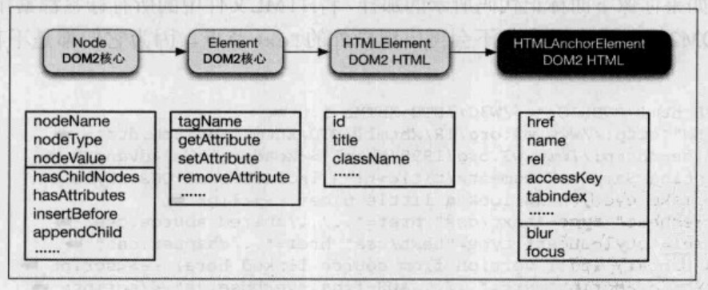

## 基础接口继承关系

## NodeList 与 HTMLCollection

> 相同点

- 两种数据结构非常相似，都是类数组对象
- 都提供了差不多的操作 DOM 方式
- 都是动态节点集合（如果 DOM 树有变化会实时反映到集合上）
- 都可以通过索引进行节点访问

> 不同点

- NodeList 中包含的是 Node 数据类型，抽象层及更高，某些 Element 层级的属性与方法不可用
- NodeList 中不仅仅包含 Element 元素，还包含其他文档元素，比如空白文白节点，注释节点等，而 HTMLCollection 中则不包含这些东西
- HTMLCollection 元素可以通过 name，id 或索引来获取；NodeList 只能通过索引来获取

**Tips：`document.querySelectorAll` 返回的是一个特殊的静态的 NodeList，虽然大部分情况下 NodeList 是动态的，但是此方法返回的是静态的**

## 核心 Element 对象

### 属性操作

当涉及到的属性与 dataset 相关时，Attribute API 与 dataset API 操作的东西其实都是 Attribute，只是不同的封装 API 而已

- Element.getAttribute
- Element.setAttribute
- Element.removeAttribute

### Element 对象查找

- getElementById
- getElementsByClassName
- getElementsByName
- getElementsByTagName
- getElementsByTagNameNS
- querySelector
- querySelectorAll
