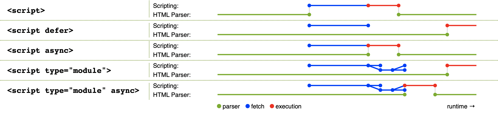

<!-- START doctoc generated TOC please keep comment here to allow auto update -->
<!-- DON'T EDIT THIS SECTION, INSTEAD RE-RUN doctoc TO UPDATE -->
**Table of Contents**  *generated with [DocToc](https://github.com/thlorenz/doctoc)*

- [script 标签](#script-%E6%A0%87%E7%AD%BE)
  - [相关属性](#%E7%9B%B8%E5%85%B3%E5%B1%9E%E6%80%A7)
  - [noscript标签](#noscript%E6%A0%87%E7%AD%BE)

<!-- END doctoc generated TOC please keep comment here to allow auto update -->

## script 标签

> 加载模式

直接出现在 Html 中的 Script 标签在 html 中默认加载模式为立即加载，立即执行会阻塞当前页面的解析流程，动态创建并插入的 Script 标签加载则由独立的线程处理，不会阻塞当前渲染线程

各个加载模式之间的区别：

> 动态加载

通过动态创建script标签并追加在html中的形式动态加载js标签默认具备async属性，不过可以将async设置为false来保证执行顺序

> 标签

scipt 为双标签，不能使用单标签形式书写

> 文件拓展名

script 的文件拓展名并没有限定为.js,只需要 script 标签的 type 类型标示正确即可

_Tips：script 使用的 src'的情况下，不应在 script 中再编写内连 JS 代码，内联 JS 将被忽略。_
*Tips：通过 innerHTML 动态添加到页面上的 script 标签则不会被执行*

> 同源策略

script 发起的 js 文件加载请求不受同源策略限制，但是其内的 js 运行时仍然受到同源策略限制

### 相关属性

- async ：立即并行下载，下载完毕后立即执行，下载会与渲染线程并行执行，加载完成后就马上执行，脚本执行时会阻塞 HTML 解析，执行顺序不保证
- crossorigin：可选。配置相关请求的 CORS(跨源资源共享)设置。默认不使用 CORS。crossorigin= "anonymous"配置文件请求不必设置凭据标志。crossorigin="use-credentials"设置凭据 标志，意味着出站请求会包含凭据。
- defer：立即并行下载，延迟执行，页面加载完成（DOMContentLoaded 之前）后再执行，执行顺序与引入顺序一致
- type：这个值始终都是"text/javascript"，JavaScript 文件的 MIME 类型通常是"application/x-javascript"，不过给 type 属性这个值有可能导致脚本被忽略。在非 IE 的浏览器中有效的其他值还有 "application/javascript"和"application/ecmascript"。如果这个值是 module，则代 码会被当成 ES6 模块，而且只有这时候代码中才能出现 import 和 export 关键字。
- integrity：（SRI， 12 Subresource Integrity）资源完整性规范的一部分，它允许你为 script 提供一个 hash，用来进行验签，检验加载的JavaScript 文件是否完整。配置这个属性后，客户端会检查CORS相关头部，如果没有响应CORS头部，

      integrity="sha256-PJJrxrJLzT6CCz1jDfQXTRWOO9zmemDQbmLtSlFQluc=" 告诉浏览器，使用sha256签名算法对下载的js文件进行计算，并与intergrity提供的摘要签名对比，如果二者不一致，就不会执行这个资源。

### noscript标签

不支持JavaScript或支持被关闭的浏览器，就显示这个标签中的内容