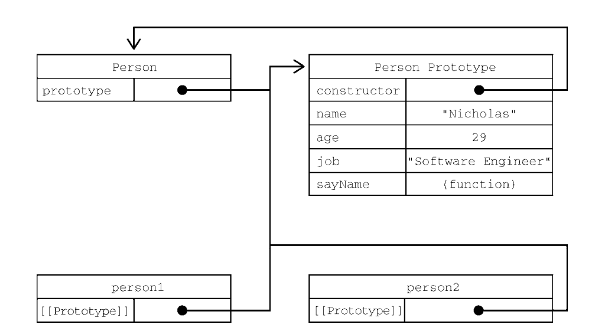

<!-- START doctoc generated TOC please keep comment here to allow auto update -->
<!-- DON'T EDIT THIS SECTION, INSTEAD RE-RUN doctoc TO UPDATE -->

- [创建对象](#%E5%88%9B%E5%BB%BA%E5%AF%B9%E8%B1%A1)
  - [工厂模式](#%E5%B7%A5%E5%8E%82%E6%A8%A1%E5%BC%8F)
  - [构造函数模式](#%E6%9E%84%E9%80%A0%E5%87%BD%E6%95%B0%E6%A8%A1%E5%BC%8F)
  - [原型模式](#%E5%8E%9F%E5%9E%8B%E6%A8%A1%E5%BC%8F)
  - [原型对象指定](#%E5%8E%9F%E5%9E%8B%E5%AF%B9%E8%B1%A1%E6%8C%87%E5%AE%9A)
- [属性的层级搜索](#%E5%B1%9E%E6%80%A7%E7%9A%84%E5%B1%82%E7%BA%A7%E6%90%9C%E7%B4%A2)
  - [确定是否含有属性](#%E7%A1%AE%E5%AE%9A%E6%98%AF%E5%90%A6%E5%90%AB%E6%9C%89%E5%B1%9E%E6%80%A7)
  - [与 in 和 for-in](#%E4%B8%8E-in-%E5%92%8C-for-in)
  - [属性枚举时的顺序](#%E5%B1%9E%E6%80%A7%E6%9E%9A%E4%B8%BE%E6%97%B6%E7%9A%84%E9%A1%BA%E5%BA%8F)
- [对象迭代](#%E5%AF%B9%E8%B1%A1%E8%BF%AD%E4%BB%A3)

<!-- END doctoc generated TOC please keep comment here to allow auto update -->

<link rel="stylesheet" href="./asset/common.css">

## 创建对象

创建对象传统的模式：

- 工厂模式
- 构造函数模式
- 原型模式
- 对象冒充

### 工厂模式

定义工厂，直接返回对象字面量

### 构造函数模式

constructor 本来是用于标识对象类型的。不过，一般认为 instanceof 操作符是确定对象类型更可靠的方式。

如果构造函数没有参数，则可以省略调用形式：`const obj = new MyClass; // 原先的： new MyClass()`

**构造函数也是函数，将他作为构造函数调用时只是使用了 new 操作符而已**

> 弊端

属性方法的唯一性：如果在构造函数中为属性动态创建方法，则所有的实例均享有自己独占的方法实例（函数实际上也是对象），每个实例间的同名成员方法其实并不是同一个；如果采用将成员函数定义在外部，虽然解决的多次创建成员函数的问题，但是会污染全局空间（全局空间并不会使用这些属于类的成员方法）

### 原型模式

将类的成员函数与静态方法直接定义到构造函数的 prototype 下，则可以实现所有实例对象共享相关属性

**Tips：Object.getPrototypeOf 方法可以返回对象实例的原型对象，尽量使用此方法，而不是使用对象实例的`__proto__`属性，因为此属性是非标准实现，虽然大家都实现了**

**Tips：不要使用 Object.setPrototypeOf 方法，不要问为什么，如果你有需求，请使用 Object.create**

```js
let Person = function () {};
Person.prototype.name = "Nicholas";
Person.prototype.job = "Software Engineer";
Person.prototype.sayName = function () {
  console.log(this.name);
};
```

下面是对构造函数、原型对象、对象实例之间联系的一个图：



### 原型对象指定

直接为构造函数指定原型对象：

```js
function Person() {}
Person.prototype = {
  name: "Nicholas",
  age: 29,
  job: "Software Engineer",
  sayName() {
    console.log(this.name);
  },
};
```

这种方式会导致原型对象的 constructor 指向出现问题，此时 constructor 并没有指向构造函数本身，而是指向 Object，虽然 instanceof 依旧能够正确识别类型，但是这仍存一定风险，因此需要手动恢复 constructor 的指向：

```js
// 恢复 constructor 属性
Object.defineProperty(Person.prototype, "constructor", {
  enumerable: false,
  value: Person,
});
```

不能在冒充的原型对象中直接定义 constructor 属性，因为开发者定义的属性都是可枚举的，而构造函数引用原生是不可枚举的，因此需要使用上面的方法进行恢复

## 属性的层级搜索

访问一个属性时，先访问对象实例本身，如果有这个属性，直接返回，如果没有，则查找对象实例的原型对象，如果有则返回，如果没有，则继续查找原型对象的原型对象，重复上述步骤，直到找到该属性或抵达原型链终端：Object，返回 undefined

因此：根据上述原则，属性覆盖优先级顺序如下：实例属性 > 原型对象属性 > 二级原型对象属性 > .... > Object 原型对象

_Tips:如果出现对象实例直接属性覆盖了原型对象属性，可以通过 delete 操作符删除对象实例的直接属性来解除覆盖_

### 确定是否含有属性

hasOwnProperty()方法用于确定某个属性是在实例上还是在原型对象上。这个方法是继承自 Object 的，会在属性存在于调用它的对象实例上时返回 true，而属性不存在或仅存在于原型链对象上时返回 false

**Tips:ECMAScript 的 Object.getOwnPropertyDescriptor()方法只对实例属性有效。要取得原型属性的描述符，就必须直接在原型对象上调用 Object.getOwnPropertyDescriptor()**

### 与 in 和 for-in

有两种方式使用 in 操作符：单独使用和在 for-in 循环中使用。在单独使用时， in 操作符会在可以通过对象访问指定属性时返回 true，无论该属性是在实例上还是在原型上。

只要通过对象可以访问， in 操作符就返回 true，而 hasOwnProperty()只有属性存在于实例上时才返回 true。因此，只要 in 操作符返回 true 且 hasOwnProperty()返回 false，就说明该属性是一个原型属性。

在 for-in 循环中使用 in 操作符时，可以通过对象访问且可以被枚举的属性都会返回，包括实例属性和原型属性。遮蔽原型中不可枚举（ [[Enumerable]]特性被设置为 false）属性的实例属性也会在 for-in 循环中返回，因为默认情况下开发者定义的属性都是可枚举的。

要获得对象上所有可枚举的实例属性，可以使用 Object.keys()方法。这个方法接收一个对象作
为参数，返回包含该对象所有可枚举属性名称的字符串数组。

**Tips：所有直接定义在原型对象上的属性都是不可枚举的（没有特殊设置的话[Object.defineProperty]）**

### 属性枚举时的顺序

for-in 循环和 Object.keys()的枚举顺序是不确定的，取决于 JavaScript 引擎，可能因浏览器而异；

Object.getOwnPropertyNames()、 Object.getOwnPropertySymbols()和 Object.assign()的枚举顺序是确定性的。先以升序枚举数值键，然后以插入顺序枚举字符串和符号键。在对象字面量中定义的键以它们逗号分隔的顺序插入

## 对象迭代

- Object.values 返回所有对象属性值的集合
- Object.entries 返回所有对象属性/值的键值对二维数组 （非字符串键会被转为字符串，符号键会被忽略，对象键则不确定会返回哪一个，因为对象 toString 后是一样的）
