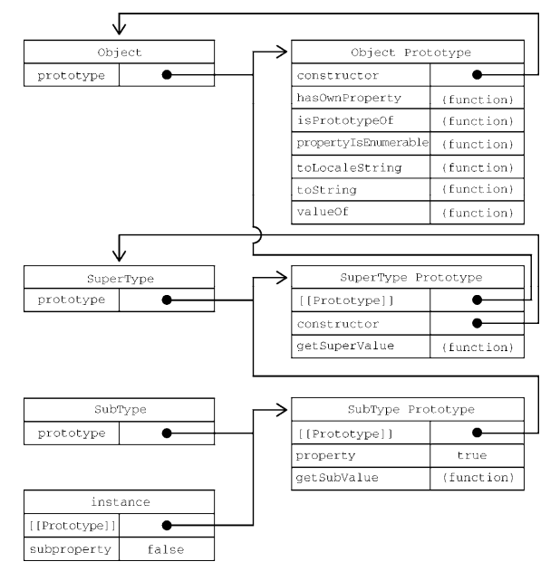

<!-- START doctoc generated TOC please keep comment here to allow auto update -->
<!-- DON'T EDIT THIS SECTION, INSTEAD RE-RUN doctoc TO UPDATE -->

- [ECMAScript 继承](#ecmascript-%E7%BB%A7%E6%89%BF)
  - [原型链](#%E5%8E%9F%E5%9E%8B%E9%93%BE)
    - [判断实例是否是某个类型](#%E5%88%A4%E6%96%AD%E5%AE%9E%E4%BE%8B%E6%98%AF%E5%90%A6%E6%98%AF%E6%9F%90%E4%B8%AA%E7%B1%BB%E5%9E%8B)
    - [继承时子类重写父类方法时的注意事项](#%E7%BB%A7%E6%89%BF%E6%97%B6%E5%AD%90%E7%B1%BB%E9%87%8D%E5%86%99%E7%88%B6%E7%B1%BB%E6%96%B9%E6%B3%95%E6%97%B6%E7%9A%84%E6%B3%A8%E6%84%8F%E4%BA%8B%E9%A1%B9)
    - [原型链的弊端](#%E5%8E%9F%E5%9E%8B%E9%93%BE%E7%9A%84%E5%BC%8A%E7%AB%AF)
  - [盗用构造函数（对象冒充/经典继承）](#%E7%9B%97%E7%94%A8%E6%9E%84%E9%80%A0%E5%87%BD%E6%95%B0%E5%AF%B9%E8%B1%A1%E5%86%92%E5%85%85%E7%BB%8F%E5%85%B8%E7%BB%A7%E6%89%BF)
    - [存在的问题](#%E5%AD%98%E5%9C%A8%E7%9A%84%E9%97%AE%E9%A2%98)
  - [组合继承](#%E7%BB%84%E5%90%88%E7%BB%A7%E6%89%BF)
  - [寄生式组合继承（最佳实践）](#%E5%AF%84%E7%94%9F%E5%BC%8F%E7%BB%84%E5%90%88%E7%BB%A7%E6%89%BF%E6%9C%80%E4%BD%B3%E5%AE%9E%E8%B7%B5)

<!-- END doctoc generated TOC please keep comment here to allow auto update -->

# ECMAScript 继承

一般来说，编程语言中继承分两种：接口继承、实现集成

在 ECMAScript 中，由于没有类型的概念，函数是没有签名的，所以不可能实现接口继承，实现继承是 ECMAScript 唯一支持的继承方式，实现媒介是原型链

## 原型链

其基本思想就是通过原型继承多个引用类型的属性和方法。重温一下构造函数、原型和实例的关系：每个构造函数都有一个原型对象，原型有一个属性指回构造函数，而实例有一个内部指针指向原型。如果原型是另一个类型的实例呢？那就意味着这个原型本身有一个内部指针指向另一个原型，相应地另一个原型也有一个指针指向另一个构造函数。这样就在实例和原型之间构造了一条原型链。这就是原型链的基本构想

```js
// 简单实现
function SuperType() {
  this.property = true;
}
SuperType.prototype.getSuperValue = function () {
  return this.property;
};
function SubType() {
  this.subproperty = false;
}
// 继承 SuperType
SubType.prototype = new SuperType();
SubType.prototype.getSubValue = function () {
  return this.subproperty;
};
let instance = new SubType();
console.log(instance.getSuperValue()); // true
```

上述例子形成的完整原型链：



### 判断实例是否是某个类型

- instanceof 操作符 ：如果一个实例的原型链中出现过相应的构造函数，则 instanceof 返回 true
- isPrototypeOf 方法：只要原型链中包含这个原型，这个方法就返回 true

```js
// instanceof
console.log(instance instanceof Object); // true
console.log(instance instanceof SuperType); // true
console.log(instance instanceof SubType); // true
// isPrototypeOf
console.log(Object.prototype.isPrototypeOf(instance)); // true
console.log(SuperType.prototype.isPrototypeOf(instance)); // true
console.log(SubType.prototype.isPrototypeOf(instance)); // true
```

### 继承时子类重写父类方法时的注意事项

子类有时候需要覆盖父类的方法，或者增加父类没有的方法。为此，这些方法必须在原型赋值之后再添加到原型上。

另一个要理解的重点是，以对象字面量方式创建原型方法会破坏之前的原型链，因为这相当于重写了原型链。

```js
// 继承 SuperType
SubType.prototype = new SuperType();
// 新方法
SubType.prototype.getSubValue = function () {
  return this.subproperty;
};

// 不要使用这种方式定义子类方法，这里实质上是进行了原型对象替换，将会导致整个原型链变化
SubType.prototype = {
  getSubValue() {
    return this.subproperty;
  },
  someOtherMethod() {
    return false;
  },
};
```

由于建立原型链时原型对象为一个对象，如果新方法先定义了，在给目标类型赋值原型链对象，将会是整体替换，先前定义的方法就会全部被替换掉

### 原型链的弊端

> 引用属性共享问题

主要问题出现在原型中包含引用值的时候，原型中包含的引用值会在所有实例间共享。这也是为什么属性通常会在构造函数中定义而不会定义在原型上的原因。

```js
function SuperType() {
  this.colors = ["red", "blue", "green"];
}
function SubType() {}
// 继承 SuperType
SubType.prototype = new SuperType();
let instance1 = new SubType();
instance1.colors.push("black");
console.log(instance1.colors); // "red,blue,green,black"
let instance2 = new SubType();
console.log(instance2.colors); // "red,blue,green,black"
```

> 无法为父类构造函数传递参数

子类型在实例化时不能给父类型的构造函数传参。事实上，我们无法在不影响所有对象实例的情况下把参数传进父类的构造函数。再加上之前提到的原型中包含引用值的问题，就导致原型链基本不会被单独使用。

## 盗用构造函数（对象冒充/经典继承）

在子类构造函数中调用父类构造函数。

```js
function SuperType(name) {
  this.colors = ["red", "blue", "green"];
  this.name = name;
}
function SubType(name) {
  // 继承 SuperType
  SuperType.call(this, name);
}
let instance1 = new SubType("jack");
instance1.colors.push("black");
console.log(instance1.colors); // "red,blue,green,black"
console.log(instance1.name); // jack
let instance2 = new SubType("Rose");
console.log(instance2.colors); // "red,blue,green"
console.log(instance2.name); // Rose
```

### 存在的问题

盗用构造函数的主要缺点，也是使用构造函数模式自定义类型的问题：必须在构造函数中定义方法,因此函数不能重用。子类也不能访问父类原型上定义的方法，因此所有类型只能使用构造函数模式。由于存在这些问题，盗用构造函数基本上也不能单独使用

## 组合继承

组合继承（有时候也叫伪经典继承）综合了原型链和盗用构造函数，将两者的优点集中了起来。基本的思路是使用原型链继承原型上的属性和方法，而通过盗用构造函数继承实例属性。这样既可以把方法定义在原型上以实现重用，又可以让每个实例都有自己的属性。

```js
function SuperType(name) {
  this.name = name;
  this.colors = ["red", "blue", "green"];
}
SuperType.prototype.sayName = function () {
  console.log(this.name);
};
function SubType(name, age) {
  // 继承属性
  SuperType.call(this, name);
  this.age = age;
}
// 继承方法
SubType.prototype = new SuperType();
SubType.prototype.sayAge = function () {
  console.log(this.age);
};
let instance1 = new SubType("Nicholas", 29);
instance1.colors.push("black");
console.log(instance1.colors); // "red,blue,green,black"
instance1.sayName(); // "Nicholas";
instance1.sayAge(); // 29
let instance2 = new SubType("Greg", 27);
console.log(instance2.colors); // "red,blue,green"
instance2.sayName(); // "Greg";
instance2.sayAge(); // 27
```

## 寄生式组合继承（最佳实践）

下面这个方法必须优先于子类成员方法定义前，原因上面已经讲过了（内部进行了原型对象的替换）

```js
function inheritPrototype(subType, superType) {
  // 拷贝父类原型对象
  let prototype = object(superType.prototype); // 创建对象
  // 建立正确的构造函数引用，指向子类
  prototype.constructor = subType; // 增强对象
  // 建立原型链引用
  subType.prototype = prototype; // 赋值对象
}
```
