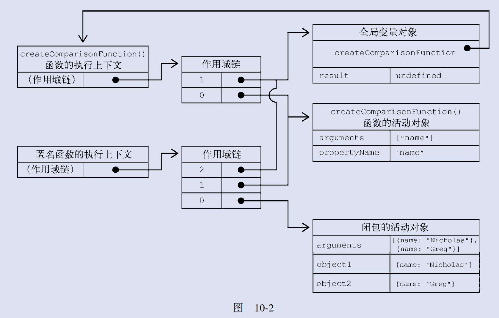

<!-- START doctoc generated TOC please keep comment here to allow auto update -->
<!-- DON'T EDIT THIS SECTION, INSTEAD RE-RUN doctoc TO UPDATE -->


- [函数基础](#%E5%87%BD%E6%95%B0%E5%9F%BA%E7%A1%80)
  - [函数定义](#%E5%87%BD%E6%95%B0%E5%AE%9A%E4%B9%89)
    - [箭头函数](#%E7%AE%AD%E5%A4%B4%E5%87%BD%E6%95%B0)
    - [函数名](#%E5%87%BD%E6%95%B0%E5%90%8D)
    - [函数参数](#%E5%87%BD%E6%95%B0%E5%8F%82%E6%95%B0)
  - [关于重载](#%E5%85%B3%E4%BA%8E%E9%87%8D%E8%BD%BD)
  - [默认参数](#%E9%BB%98%E8%AE%A4%E5%8F%82%E6%95%B0)
  - [参数扩展/收集（可变参数）](#%E5%8F%82%E6%95%B0%E6%89%A9%E5%B1%95%E6%94%B6%E9%9B%86%E5%8F%AF%E5%8F%98%E5%8F%82%E6%95%B0)
  - [函数声明与函数表达式](#%E5%87%BD%E6%95%B0%E5%A3%B0%E6%98%8E%E4%B8%8E%E5%87%BD%E6%95%B0%E8%A1%A8%E8%BE%BE%E5%BC%8F)
  - [函数/函数内部的特殊值](#%E5%87%BD%E6%95%B0%E5%87%BD%E6%95%B0%E5%86%85%E9%83%A8%E7%9A%84%E7%89%B9%E6%AE%8A%E5%80%BC)
    - [arguments](#arguments)
    - [this 函数执行上下文](#this-%E5%87%BD%E6%95%B0%E6%89%A7%E8%A1%8C%E4%B8%8A%E4%B8%8B%E6%96%87)
    - [new.target](#newtarget)
    - [caller](#caller)
  - [函数属性与方法](#%E5%87%BD%E6%95%B0%E5%B1%9E%E6%80%A7%E4%B8%8E%E6%96%B9%E6%B3%95)
  - [函数表达式](#%E5%87%BD%E6%95%B0%E8%A1%A8%E8%BE%BE%E5%BC%8F)
  - [递归函数最佳实践](#%E9%80%92%E5%BD%92%E5%87%BD%E6%95%B0%E6%9C%80%E4%BD%B3%E5%AE%9E%E8%B7%B5)
  - [尾调用优化](#%E5%B0%BE%E8%B0%83%E7%94%A8%E4%BC%98%E5%8C%96)
  - [闭包](#%E9%97%AD%E5%8C%85)
  - [关于 this](#%E5%85%B3%E4%BA%8E-this)
  - [闭包引起的内存泄漏](#%E9%97%AD%E5%8C%85%E5%BC%95%E8%B5%B7%E7%9A%84%E5%86%85%E5%AD%98%E6%B3%84%E6%BC%8F)
  - [IIFE 立即调用函数](#iife-%E7%AB%8B%E5%8D%B3%E8%B0%83%E7%94%A8%E5%87%BD%E6%95%B0)

<!-- END doctoc generated TOC please keep comment here to allow auto update -->

# 函数基础

函数实际上是对象。每个函数都是 Function 类型的实例，而 Function 也有属性和方法，跟其他引用类型一样。因为函数是对象，所以函数名就是指向函数对象的指针，而且不一定与函数本身紧密绑定。

## 函数定义

```js
// 直接定义
function Fn() {}
// 函数表达式
const a = function () {};
// 箭头函数/Lamda
const b = () => {};
// 解释性定义
const c = new Function("param1", "param2", "return param1 + param2");
```

### 箭头函数

箭头函数的特点：

- 不能使用 arguments、 super 和 new.target
- 不能用作构造函数
- 箭头函数没有 prototype 属性

```js
let arrowSum = (a, b) => {
  return a + b;
};
```

### 函数名

函数对象都具备 name 属性，存放 function 的字符串标示符描述，函数表达式在不对外赋值的情况下，name 属性为空，如果声明时采用匿名形式并对变量进行了赋值，则函数对象的 name 为变量名字符串，如果采用命名表达式，则名称为实际的函数命名，如果使用 Function 构造函数创建函数，则 name 为：`anonymous`固定值：

```js
const fnName = () => {};
fnName.name; // fnName
const fn = function hasName() {};
fn.name; // hasName
(() => {}).name; // ''
const conFn = new Function();
conFn.name; // anonymous
```

### 函数参数

在 ECMAScript 中，函数的参数与其他语言，有很大不同，函数中除了函数声明的形式参数外，还有一个隐含的实际参数数组引用，`arguments`，与显示声明的形式参数一一对应，下面是关于他们之间的一些特点（非严格模式下的，所以看看就好）：

- 声明的形式参数与隐式参数数组中的值是同步的：修改了之后会同步反应在另外一边（严格模式下修改 arguments 参数数组会报错）
- 如果修改 arguments 数组时超过了实际参数个数，则第一条的同步作用将不会生效
- 形式参数与 arguments 之间虽然值是同步的，但是他们并不是引用的同一片内存区域，只是只同步而已
- 如果函数定义使用的是箭头函数，则函数内 arguments 是不可用的

**重点：ECMAScript 中的所有参数都按值传递的。不可能按引用传递参数。如果把对象作为参数传递，那么传递的值就是这个对象的引用。**

## 关于重载

ECMAScript 中没有重载的直接实现，由于函数本身根本就没有函数签名这么一说，自然也就没有重载，如果函数进行了重名定义，则后定义后覆盖先前的定义。

这里理解成函数表达式赋值给了某一个局部变量是一样的：再次给该变量赋值当然是后赋予的值覆盖之前的值

## 默认参数

ES5 之前，不支持默认参数，只能通过参数是否为 undefined 来判断，ES6 及之后，可以直接在形式参数上定义默认参数值，所有的必选参数必须在默认参数前面

_Tips：函数默认值可以使用表达式，该表达式的结果使用延迟运算，只在实际调用发生时进行计算_

默认参数可以进行前向引用：后面的参数可以引用前面的参数进行默认赋值，规则遵循变量的 TDZ（临时性死区）规则，因此只能进行前向引用，也不能引用函数作用域内的变量定义

## 参数扩展/收集（可变参数）

原先进行参数扩展传入时可能只能使用如下这种代码：

```js
// ES6之前
fn.apply(null, [1, 2, 3, 4]);
// ES6之后
fn(...[1, 2, 3, 4]);
```

参数收集，类似于 c 语言中的可变参数，可将剩余的参数全部放入一个形式参数中，接收形式为数组：

```js
function fn(...rest) {}
```

## 函数声明与函数表达式

函数声明存在声明提升，会将函数声明提升至当前执行上下文顶部，因此使用函数声明进行声明的函数可以在声明之前使用，函数声明的限制作用域为函数作用域；

函数表达式不存在声明提升，作用域为块级作用域；

## 函数/函数内部的特殊值

### arguments

对所有实际参数的收集引用，箭头函数定义的函数内部，此变量不可用，arguments 是一个类数组对象，

- 其上还有一个特殊属性：`callee`索引的是当前 arguments 所在的函数，如果正在编写递归调用，请使用 arguments.callee 进行自引用调用，不要使用函数名；还可以用这个属性的 length 来确定行参个数，当然，使用函数名也可以
- fn.caller：caller 在函数对象上，执行时访问这个属性可以确定调用者是谁

### this 函数执行上下文

它在标准函数和箭头函数中有不同的行为，在标准函数中， this 引用的是把函数当成方法调用的上下文对象，这时候通常称其为 this 值（在
网页的全局上下文中调用函数时， this 指向 windows）；在箭头函数中， this 引用的是定义箭头函数的上下文

### new.target

如果函数正常调用则 new.target 的值是 undefined；如果是使用 new 关键字调用的，则 new.target 将引用被调用的构造函数。

### caller

fn.caller 这个属性引用的是调用当前函数的函数，或者如果是在全局作用域中调用的则为 null，如果要降低耦合度，则可以通过 arguments.callee.caller 来引用

**Tips：在严格模式下访问 arguments.callee 是会报错的，所以在递归函数内自引用到底该怎么写！！！（使用命名的函数表达式）**

## 函数属性与方法

- length：函数形式参数个数
- prototype：保存函数的原型对象，其上定义了通过这个函数实例化的对象所共享的成员方法，该属性不可枚举
- call：指定函数调用上下文来调用函数，后续参数作为目标函数的参数传入`fn.call(obj,param1,param2)`
- apply：作用与 call 一致，只是入参改为了类数组对象`fn.apply(obj,[param1,param2])`
- bind：为了解决函数调用时 this 指向不曾缺的问题，可以对 this 进行提前绑定

## 函数表达式

请在需要使用条件判断进行不同函数定义时的场景下使用函数表达式，不要使用函数声明，因为函数声明存在声明提升，因此会导致结果不符合预期；其他情况，请便。

## 递归函数最佳实践

由于递归函数需要进行自引用，而直接引用函数名存在二次赋值时自引用不存在的风险，虽然 arguments 提供了 callee 属性供我们来访问当前函数，但是这个属性在严格模式下时不可用的，此时我们可以使用命名函数表达式来解决这个矛盾的问题：

```js
const fn = function fact(num) {
  if (num <= 1) {
    return 1;
  } else {
    return num * fact(num - 1);
  }
};
const fnClone = fn;
fnClone(10); // 正确
```

## 尾调用优化

如果函数 return 了另外一个函数调用，则解释器可能会直接销毁当前函数的调用栈，这样能减少函数栈嵌套深度，这个优化在编写递归调用代码时，尤为重要；满足尾调用优化的条件如下（同时满足）：

- 代码运行在严格模式
- 外部函数的返回值是对尾调用函数的调用
- 尾调用函数的返回值不需要额外处理（比如 toString 之类的）
- 尾调用函数不能对外部函数作用域中的变量形成闭包引用

_Tips：对于像求取斐波纳切数值之类的递归调用，尾调用优化尤其重要，在运算规模足够大的情况虾，不优化基本都会爆栈_

## 闭包

内层函数引用外层函数作用域中变量的行为被称作闭包引用，这种引用，在外层函数返回值为内部函数时，外层函数返回后，外层函数的执行上下文环境并不会销毁，必须等到被返回的函数所创建的执行上下文释放后才能销毁，如果该函数继续创建闭包，则遵循该原则继续套娃。



## 关于 this

有以下几个特点：

- 普通函数执行时会将 this 绑定到执行上下文
- 箭头函数内部的 this，将会是绑定到他声明时的执行上下文；或者换个说法：箭头函数内部没有属于箭头函数的 this，因此他只能使用最近的外部 this，以前就是离声明他的函数表达式最近的一个普通函数的执行上下文。
- 如果要在内层函数访问外层函数的 this 与 arguments，只能使用赋值+闭包的形式来实现

一个小栗子：

```js
window.identity = "The Window";
let object = {
  identity: "My Object",
  getIdentity() {
    return this.identity;
  },
};
object.getIdentity(); // 'My Object'
// 这里使用注释书写，括号会被prettier格式化去掉
// (object.getIdentity)(); // 'My Object'
(object.getIdentity = object.getIdentity)(); // 'The Window'
```

第三行执行了一次赋值，然后再调用赋值后的结果。因为赋值表达式的值是函数本身， this 值不再与任何对象绑定，所以返回的是"The Window"。

## 闭包引起的内存泄漏

一个闭包函数，将会对外层函数执行上下文环境（或者理解为栈空间对象）进行引用，即使函数内部没有对外层函数的局部变量进行直接引用，仍然会造成外部函数的局部变量得不到释放：即使内部函数没有直接引用，但是内部函数引用了外部函数的执行上下文，而执行上下文又对局部变量进行了直接引用，因此外部函数的局部变量无法得到释放；

解决办法：

1. 不要再内部函数中直接引用复杂对象，或者避免创建循环引用，尤其是 DOM 元素的回调处理程序，尤其注意
2. 外层函数尾部进行复杂对象的显示销毁：将他们全部置为 null

```js
function assignHandler() {
  let element = document.getElementById("someElement");
  let id = element.id;
  element.onclick = () => console.log(id);
  element = null;
}
```

## IIFE 立即调用函数

IIFE 只要用于在 ES5 及之前的环境模拟块级作用域，以及进行环境隔离；在 ES6 之后，由于原生支持块级作用域，因此就不是那么必须了：

```js
// ES6之前的写法
let divs = document.querySelectorAll("div");
for (var i = 0; i < divs.length; ++i) {
  divs[i].addEventListener(
    "click",
    // 由于在ES6之前for没有块级作用域，因此所有事件处理程序闭包引用的i都是同一个变量，此处使用IIFE，利用了ECMAScript中函数参数都是按值传递的特性来实现参数锁定达到模拟块级作用域的效果
    (function (frozenCounter) {
      return function () {
        console.log(frozenCounter);
      };
    })(i)
  );
}

// ES6及其之后的写法
let divs = document.querySelectorAll("div");
for (let i = 0; i < divs.length; ++i) {
  divs[i].addEventListener("click", function () {
    // 直接使用i即可，因为for具备块级作用域，每一次循环，i变量都是一个独立的变量
    console.log(i);
  });
}
```
