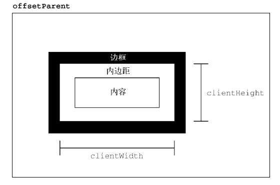
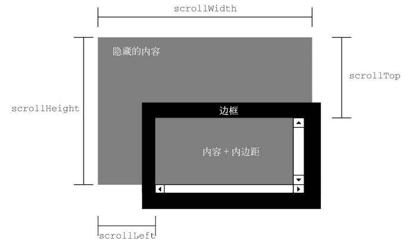
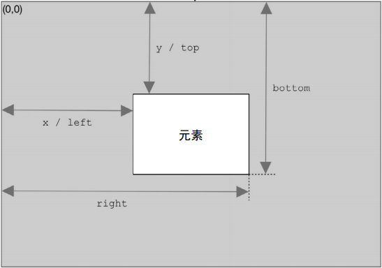

<!-- START doctoc generated TOC please keep comment here to allow auto update -->
<!-- DON'T EDIT THIS SECTION, INSTEAD RE-RUN doctoc TO UPDATE -->

**Table of Contents** _generated with [DocToc](https://github.com/thlorenz/doctoc)_

- [简述](#%E7%AE%80%E8%BF%B0)
- [存取样式](#%E5%AD%98%E5%8F%96%E6%A0%B7%E5%BC%8F)
- [DOM 样式属性和方法](#dom-%E6%A0%B7%E5%BC%8F%E5%B1%9E%E6%80%A7%E5%92%8C%E6%96%B9%E6%B3%95)
- [操作样式表](#%E6%93%8D%E4%BD%9C%E6%A0%B7%E5%BC%8F%E8%A1%A8)
- [偏移/尺寸（重点）](#%E5%81%8F%E7%A7%BB%E5%B0%BA%E5%AF%B8%E9%87%8D%E7%82%B9)
  - [offset 相对距离](#offset-%E7%9B%B8%E5%AF%B9%E8%B7%9D%E7%A6%BB)
  - [client 客户端尺寸](#client-%E5%AE%A2%E6%88%B7%E7%AB%AF%E5%B0%BA%E5%AF%B8)
  - [scroll 滚动尺寸](#scroll-%E6%BB%9A%E5%8A%A8%E5%B0%BA%E5%AF%B8)
  - [确定元素尺寸](#%E7%A1%AE%E5%AE%9A%E5%85%83%E7%B4%A0%E5%B0%BA%E5%AF%B8)
- [节点遍历](#%E8%8A%82%E7%82%B9%E9%81%8D%E5%8E%86)
- [操作 DOM 范围](#%E6%93%8D%E4%BD%9C-dom-%E8%8C%83%E5%9B%B4)

<!-- END doctoc generated TOC please keep comment here to allow auto update -->

## 简述

HTML 中的样式有 3 种定义方式：外部样式表（通过`<link>`元素）、文档样式表（使用`<style>`元素）和元素特定样式（使用 style 属性）。DOM2Style 为这 3 种应用样式的机制都提供了 API。

CSS 属于 DOM 规范，从 DOMLevel1 就已经存在了，目前（2021-05-1418:38:45）已经有三个正式版本，第四版处于草案阶段

## 存取样式

任何支持 style 属性的 HTML 元素在 JavaScript 中都会有一个对应的 style 属性。HTMLstyle 属性中的 CSS 属性在 JavaScriptstyle 对象中都有对应的属性。因为 CSS 属性名使用连字符表示法（用连字符分隔两个单词，如 background-image），所以在 JavaScript 中这些属性必须转换为驼峰大小写形式

**Tips：大多数属性名会这样直接转换过来。但有一个 CSS 属性名不能直接转换，它就是 float。因为 float 是 JavaScript 的保留字，所以不能用作属性名。 DOM2 Style 规定它在 style 对象中对应的属性应该是 cssFloat。**

```js
let myDiv = document.getElementById("myDiv");
// 设置背景颜色
myDiv.style.backgroundColor = "red";
// 修改大小
myDiv.style.width = "100px";
myDiv.style.height = "200px";
// 设置边框
myDiv.style.border = "1px solid black";
```

**Tips:在标准模式下，所有尺寸都必须包含单位。**

## DOM 样式属性和方法

- cssText，读：包含 style 属性中的 CSS 代码，写：重写元素的所有 css 样式,通过 class 以及标签选择匹配的样式不受影响
- length，应用给元素的 CSS 属性数量

## 操作样式表

使用 Link 标签，或者 Style 标签引入/定义的样式表节点，具备一些非常有意思的点：

- disabled：节点上唯一一个可读写的属性，设置为 true 之后，相应的样式表江北禁用
- media：样式表所支持的设备类型
- parentStyleSheet，如果当前样式表是通过@import 被包含在另一个样式表中，则这个属性指向导入它的样式表。

## 偏移/尺寸（重点）

### offset 相对距离

宽高描述的是在当前布局上下问中所占用的空间大小（建筑面积）

- offsetHeight：顶部相对于父级元素内部顶部的偏移距离
- offsetLeft：左侧相对于父级元素内部左侧的偏移距离
- offsetWidth：元素水平方向上占用的像素尺寸（包含边框与内边距）
- offsetHeight：元素垂直方向上占用的像素尺寸（包含边框与内边距）
- offsetParent：索引当前元素的父级元素


```js
// 获取元素在页面中的相对偏移(X轴)
function getElementLeft(element) {
  let actualLeft = element.offsetLeft;
  let current = element.offsetParent;
  while (current !== null) {
    actualLeft += current.offsetLeft;
    current = current.offsetParent;
  }
  return actualLeft;
}
// 获取元素在页面中的相对偏移(Y轴)
function getElementTop(element) {
  let eleTop = element.offsetTop;
  let current = element.offsetParent;
  while (current !== null) {
    eleTop += current.offsetTop;
    current = current.offsetParent;
  }
  return eleTop;
}
// 获取元素在页面中的相对位置，非常常用的一个实现
function getElementPosition(ele) {
  return { x: getElementLeft(ele), y: getElementTop(ele) };
}

// 递归实现
function getElementTop(element) {
  if (element.offsetParent !== null) {
    // 此处不会应用尾调用优化，因此如果层级非常深，可能会栈溢出
    return getElementTop(element.offsetParent) + element.offsetTop;
  }
  return element.offsetTop;
}
```

### client 客户端尺寸

这些属性主要用于表示元素视口尺寸,也就是元素内部的布局空间到底有多大（套内面积）

- clientWidth：clientWidth 是内容区宽度加左、右内边距宽度（不含边框）
- clientHeight：clientHeight 是内容区高度加上、下内边距高度（不含边框）



**Tips：所有这些偏移尺寸属性都是只读的，每次访问都会重新计算。因此，应该尽量减少查询它们的次数。**

**Important：客户端尺寸实际上就是元素内部的空间，因此不包含滚动条占用的空间**

### scroll 滚动尺寸

scrollWidth 和 scrollHeight 可以用来确定给定元素内容的实际尺寸，例如， `<html>`元素是浏览器中滚动视口的元素。因此， document.documentElement.scrollHeight 就是整个页面垂直方向的总高度。

scrollWidth 和 scrollHeight 与 clientWidth 和 clientHeight 之间的关系在不需要滚动的文档上是分不清的。如果文档尺寸超过视口尺寸，则在所有主流浏览器中这两对属性都不相等，scrollWidth 和 scollHeight 等于文档内容的宽高，而 clientWidth 和 clientHeight 等于视口的大小。

- scrollWidth，没有滚动条出现时，元素内容的总宽度
- scrollHeight，没有滚动条出现时，元素内容的总高度。
- scrollLeft，内容区左侧隐藏的像素数，设置这个属性可以改变元素的滚动位置。
- scrollTop，内容区顶部隐藏的像素数，设置这个属性可以改变元素的滚动位置。



### 确定元素尺寸

浏览器在每个元素上都暴露了 getBoundingClientRect()方法，返回一个 DOMRect 对象，包含 6 个属性： left、 top、 right、 bottom、 height 和 width。这些属性给出了元素在页面中相对于视口的位置。图 16-4① 展示了这些属性的含义。

width、height 表示元素实际建筑面积，包含边框与内边距,不包含楼间距(margin)



## 节点遍历

深度优先遍历 API：NodeIterator 和 TreeWalker

## 操作 DOM 范围

document.createRange 定义了操作 DOM 范围的 API，可以选定某一个 DOM 范围，进行删除、复制

- range.selectNode 选择某个节点作为范围
- range.selectNodeContent 选择某个节点的 Content 作为范围
- range.deleteContents 删除划定范围的 DOM
- range.extractContents 删除划定范围的 DOM，并返回这个片段
- range.cloneContents 复制一个范围的 DOM
- range.detach 释放范围，解除引用
