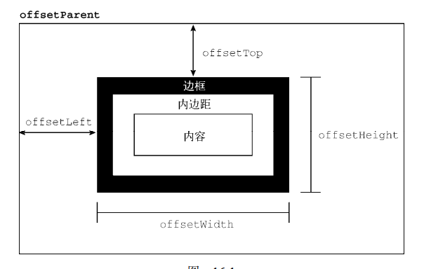
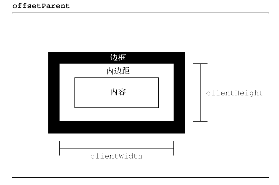
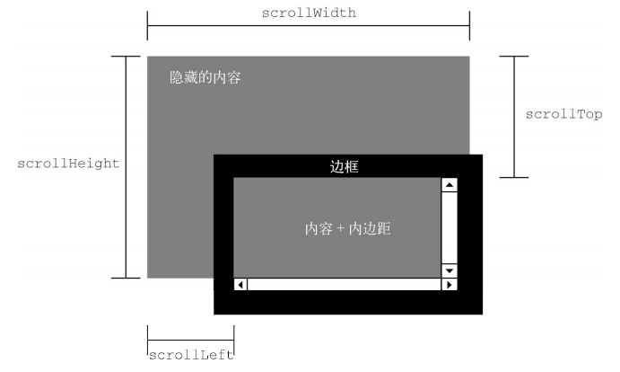
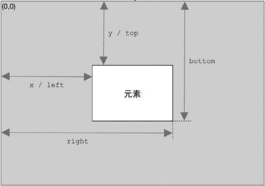

<!-- START doctoc generated TOC please keep comment here to allow auto update -->
<!-- DON'T EDIT THIS SECTION, INSTEAD RE-RUN doctoc TO UPDATE -->


- [偏移/尺寸（重点）](#%E5%81%8F%E7%A7%BB%E5%B0%BA%E5%AF%B8%E9%87%8D%E7%82%B9)
  - [offset 相对距离](#offset-%E7%9B%B8%E5%AF%B9%E8%B7%9D%E7%A6%BB)
  - [client 客户端尺寸](#client-%E5%AE%A2%E6%88%B7%E7%AB%AF%E5%B0%BA%E5%AF%B8)
  - [scroll 滚动尺寸](#scroll-%E6%BB%9A%E5%8A%A8%E5%B0%BA%E5%AF%B8)
  - [确定元素尺寸](#%E7%A1%AE%E5%AE%9A%E5%85%83%E7%B4%A0%E5%B0%BA%E5%AF%B8)

<!-- END doctoc generated TOC please keep comment here to allow auto update -->

## 偏移/尺寸（重点）

### offset 相对距离

宽高描述的是在当前布局上下问中所占用的空间大小（建筑面积）

- offsetHeight：顶部相对于父级元素内部顶部的偏移距离
- offsetLeft：左侧相对于父级元素内部左侧的偏移距离
- offsetWidth：元素水平方向上占用的像素尺寸（包含边框与内边距）
- offsetHeight：元素垂直方向上占用的像素尺寸（包含边框与内边距）
- offsetParent：索引当前元素的父级元素



```js
// 获取元素在页面中的相对偏移(X轴)
function getElementLeft(element) {
  let actualLeft = element.offsetLeft;
  let current = element.offsetParent;
  while (current !== null) {
    actualLeft += current.offsetLeft;
    current = current.offsetParent;
  }
  return actualLeft;
}
// 获取元素在页面中的相对偏移(Y轴)
function getElementTop(element) {
  let eleTop = element.offsetTop;
  let current = element.offsetParent;
  while (current !== null) {
    eleTop += current.offsetTop;
    current = current.offsetParent;
  }
  return eleTop;
}
// 获取元素在页面中的相对位置，非常常用的一个实现
function getElementPosition(ele) {
  return { x: getElementLeft(ele), y: getElementTop(ele) };
}

// 递归实现
function getElementTop(element) {
  if (element.offsetParent !== null) {
    // 此处不会应用尾调用优化，因此如果层级非常深，可能会栈溢出
    return getElementTop(element.offsetParent) + element.offsetTop;
  }
  return element.offsetTop;
}
```

### client 客户端尺寸

这些属性主要用于表示元素视口尺寸,也就是元素内部的布局空间到底有多大（套内面积）

- clientWidth：clientWidth 是内容区宽度加左、右内边距宽度（不含边框）
- clientHeight：clientHeight 是内容区高度加上、下内边距高度（不含边框）



**Tips：所有这些偏移尺寸属性都是只读的，每次访问都会重新计算。因此，应该尽量减少查询它们的次数。**

**Important：客户端尺寸实际上就是元素内部的空间，因此不包含滚动条占用的空间**

### scroll 滚动尺寸

scrollWidth 和 scrollHeight 可以用来确定给定元素内容的实际尺寸，例如， `<html>`元素是浏览器中滚动视口的元素。因此， document.documentElement.scrollHeight 就是整个页面垂直方向的总高度。

scrollWidth 和 scrollHeight 与 clientWidth 和 clientHeight 之间的关系在不需要滚动的文档上是分不清的。如果文档尺寸超过视口尺寸，则在所有主流浏览器中这两对属性都不相等，scrollWidth 和 scollHeight 等于文档内容的宽高，而 clientWidth 和 clientHeight 等于视口的大小。

- scrollWidth，没有滚动条出现时，元素内容的总宽度
- scrollHeight，没有滚动条出现时，元素内容的总高度。
- scrollLeft，内容区左侧隐藏的像素数，设置这个属性可以改变元素的滚动位置。
- scrollTop，内容区顶部隐藏的像素数，设置这个属性可以改变元素的滚动位置。



### 确定元素尺寸

浏览器在每个元素上都暴露了 getBoundingClientRect()方法，返回一个 DOMRect 对象，包含 6 个属性： left、 top、 right、 bottom、 height 和 width。这些属性给出了元素在页面中相对于视口的位置。图 16-4① 展示了这些属性的含义。

width、height 表示元素实际建筑面积，包含边框与内边距,不包含楼间距(margin)


