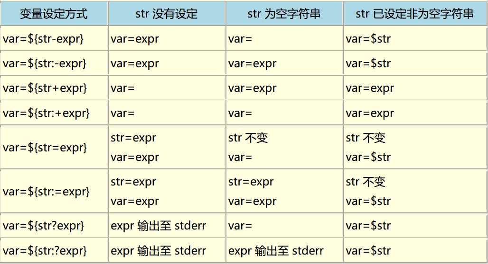

<!-- START doctoc generated TOC please keep comment here to allow auto update -->
<!-- DON'T EDIT THIS SECTION, INSTEAD RE-RUN doctoc TO UPDATE -->
**Table of Contents**  *generated with [DocToc](https://github.com/thlorenz/doctoc)*

- [Shell基础](#shell%E5%9F%BA%E7%A1%80)
    - [语法声明](#%E8%AF%AD%E6%B3%95%E5%A3%B0%E6%98%8E)
    - [简单交互](#%E7%AE%80%E5%8D%95%E4%BA%A4%E4%BA%92)

<!-- END doctoc generated TOC please keep comment here to allow auto update -->

## Shell基础

#### 语法声明

开头必须是`#!/bin/bash`指定该shell运行所使用的环境

#### 简单交互

read 指令，可以输出获取用户输入，并给出提示信息

栗子：

	read -p "提示信息" valName
	echo -e "您的输入为：$valName"

