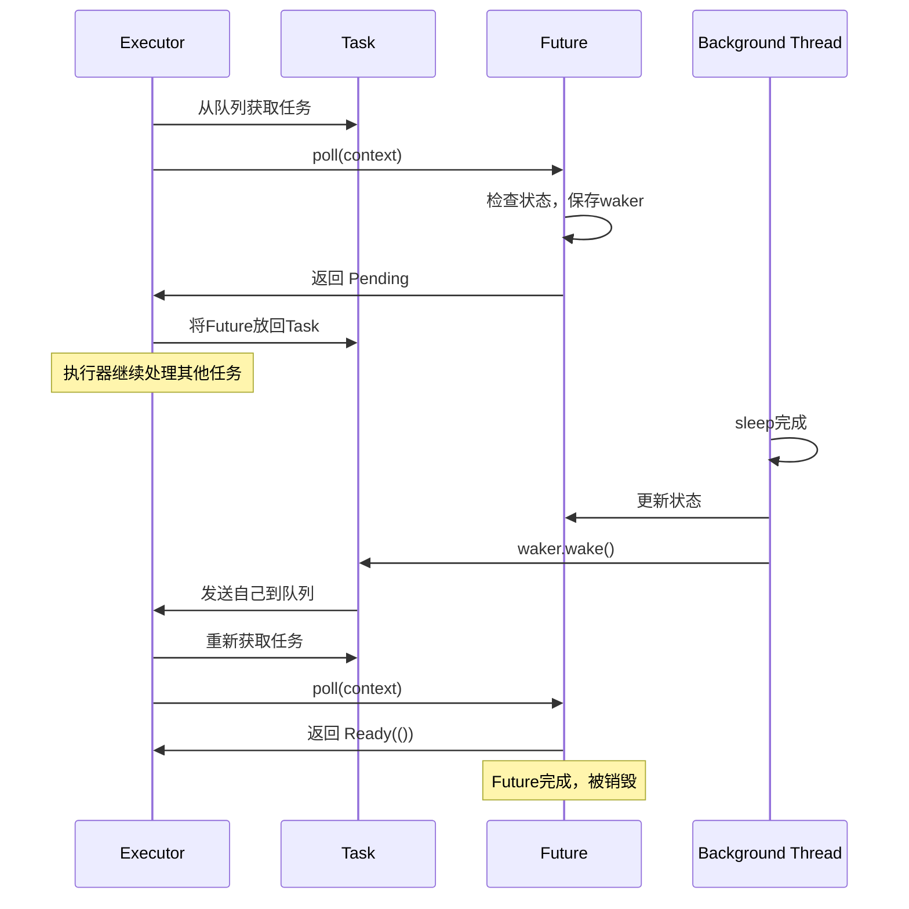

```mermaid
sequenceDiagram
    participant E as Executor
    participant T as Task
    participant F as Future
    participant BG as Background Thread

    E->>T: 从队列获取任务
    E->>F: poll(context)
    F->>F: 检查状态，保存waker
    F->>E: 返回 Pending
    E->>T: 将Future放回Task
    Note over E: 执行器继续处理其他任务

    BG->>BG: sleep完成
    BG->>F: 更新状态
    BG->>T: waker.wake()
    T->>E: 发送自己到队列

    E->>T: 重新获取任务
    E->>F: poll(context)
    F->>E: 返回 Ready(())
    Note over F: Future完成，被销毁
```
