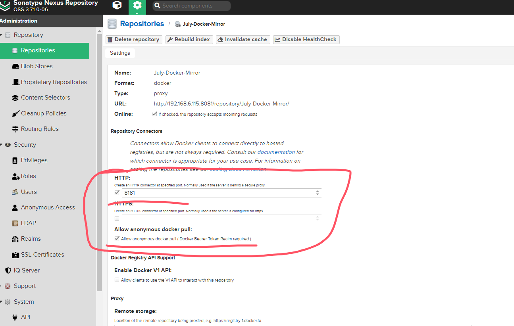
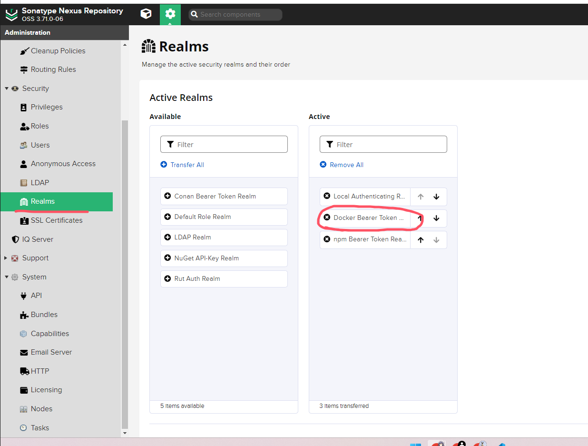

<!-- START doctoc generated TOC please keep comment here to allow auto update -->
<!-- DON'T EDIT THIS SECTION, INSTEAD RE-RUN doctoc TO UPDATE -->
**Table of Contents**  *generated with [DocToc](https://github.com/thlorenz/doctoc)*

- [设置使用自建的镜像加速站](#设置使用自建的镜像加速站)
  - [创建加速镜像仓库](#创建加速镜像仓库)

<!-- END doctoc generated TOC please keep comment here to allow auto update -->

## 设置使用自建的镜像加速站

### 创建加速镜像仓库

创建 Docker 镜像加速仓库，记得开启仓库的 HTTP 自定义端口，Docker 不支持使用 URL 配置自定义仓库，只能使用根路径，所以需要配置别名端口映射，开启匿名访问，远端仓库地址填写：`https://registry-1.docker.io/`，配置如下：



添加 Docker 身份验证支持：



创建配置文件，默认是没有这个文件的：`/etc/docker/daemon.json`

文件内容：

```json
{
  "registry-mirrors": ["http://192.168.6.207:8181"],
  "insecure-registries": ["192.168.6.207:8181"]
}
```

- registry-mirrors：优先使用的自定义镜像库位置
- insecure-registries：不验证是否安全的镜像库，如果没有配置 TLS，此项必须配置否则验证通不过

然后重启服务：`systemctl restart docker`

此时拉取镜像的时候就会使用自定义的镜像加速站了。
