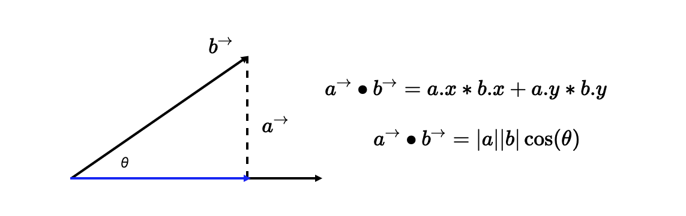
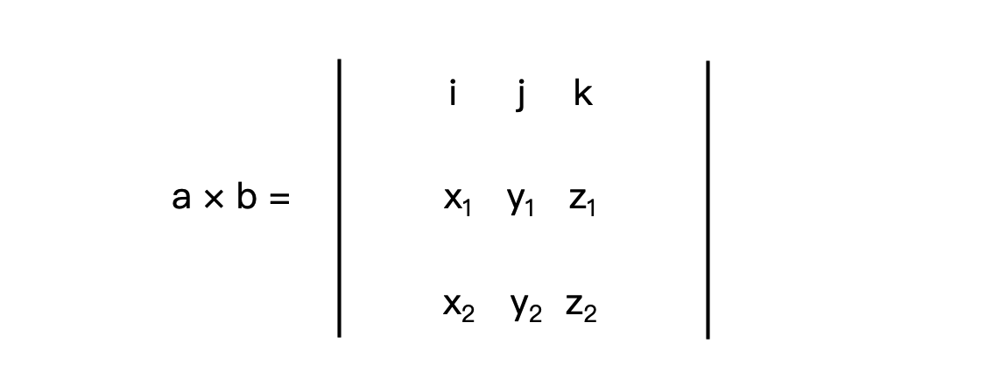

<!-- START doctoc generated TOC please keep comment here to allow auto update -->
<!-- DON'T EDIT THIS SECTION, INSTEAD RE-RUN doctoc TO UPDATE -->
**Table of Contents**  *generated with [DocToc](https://github.com/thlorenz/doctoc)*

- [点乘](#%E7%82%B9%E4%B9%98)
- [叉乘](#%E5%8F%89%E4%B9%98)

<!-- END doctoc generated TOC please keep comment here to allow auto update -->

## 点乘

假设，现在有两个 N 维向量 a 和 b，`a = [a1, a2, ...an]，b = [b1, b2, ...bn]`，那向量的点积公式如下：

```
a•b = a1*b1 + a2*b2 + ... + an*bn
a•b = |a|*|b|*cos(θ)
```



几何含义：向量**a 的模**乘以**向量 b 在向量 a 方向上的投影**长度

物理意义：相当于 a 力作用于物体，产生 b 在 a 方向投影长度位移所做的功

## 叉乘

特点：

- 向量叉乘运算的结果不是标量，而是一个向量
- 两个向量的叉积得到的新向量与两个原始向量所组成的坐标平面垂直（三个向量所组成的三维坐标系是右手坐标系）

几何意义：a、b 组成的平行四边形的面积


数学计算方法：



```
A*B=x1*y2-x2*y1
```

高维叉乘：https://www.cnblogs.com/monoSLAM/p/5349497.html
