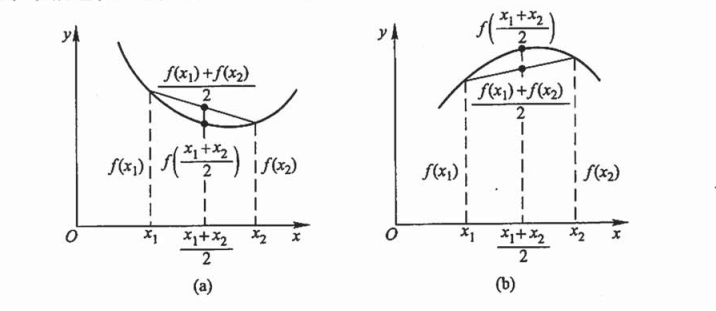

<!-- START doctoc generated TOC please keep comment here to allow auto update -->
<!-- DON'T EDIT THIS SECTION, INSTEAD RE-RUN doctoc TO UPDATE -->
**Table of Contents**  *generated with [DocToc](https://github.com/thlorenz/doctoc)*

- [函数的凸凹性判断准则](#%E5%87%BD%E6%95%B0%E7%9A%84%E5%87%B8%E5%87%B9%E6%80%A7%E5%88%A4%E6%96%AD%E5%87%86%E5%88%99)
  - [二阶导判断凸凹性](#%E4%BA%8C%E9%98%B6%E5%AF%BC%E5%88%A4%E6%96%AD%E5%87%B8%E5%87%B9%E6%80%A7)

<!-- END doctoc generated TOC please keep comment here to allow auto update -->

## 函数的凸凹性判断准则

定义：若函数 $f(x)$ 在区间 $(a,b)$ 上连续，且对于任意 $x_1,x_2 \in (a,b)$ ，恒有：

$$f(\frac{x_1+x_2}{2}) < \frac{f(x_1)+f(x_2)}{2}$$

那么称函数 $f(x)$ 在区间 $(a,b)$ 上的图形是凹函数。如果恒有：

$$f(\frac{x_1+x_2}{2}) > \frac{f(x_1)+f(x_2)}{2}$$

那么称函数 $f(x)$ 在区间 $(a,b)$ 上的图形是凸函数。

### 二阶导判断凸凹性

如果函数存在二阶导数，那么可以用二阶导数的正负性来判断函数的凸凹性。

假设函数 $f(x)$ 在区间 $(a,b)$ 上连续，且 $f^{'}(x) ,f^{''}(x)$ 存在,那么

- 如果 $f^{''}(x) > 0$ ，那么 $f(x)$ 在区间 $(a,b)$ 上是凹函数
- 如果 $f^{''}(x) < 0$ ，那么 $f(x)$ 在区间 $(a,b)$ 上是凸函数
