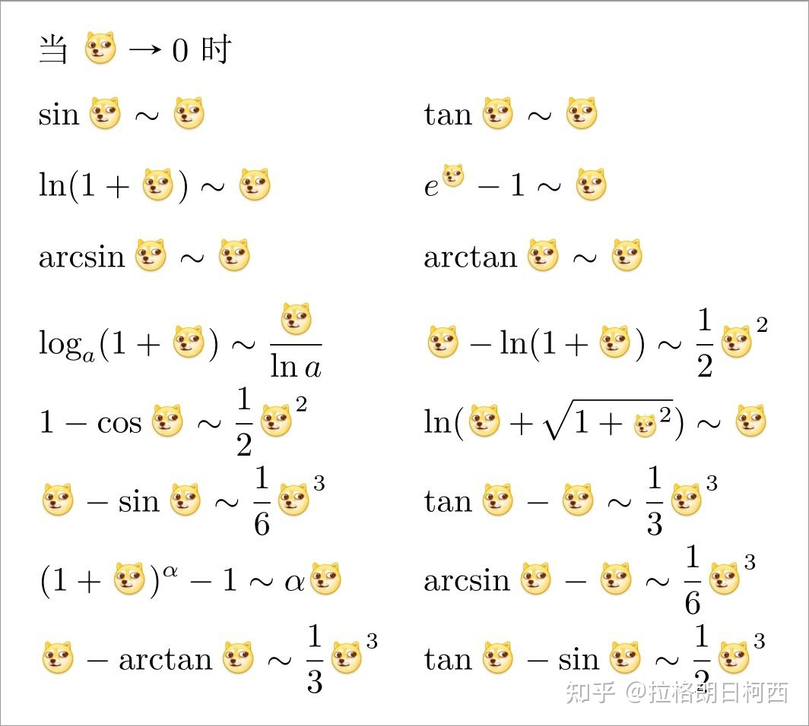

<!-- START doctoc generated TOC please keep comment here to allow auto update -->
<!-- DON'T EDIT THIS SECTION, INSTEAD RE-RUN doctoc TO UPDATE -->
**Table of Contents**  *generated with [DocToc](https://github.com/thlorenz/doctoc)*

- [极限运算法则](#%E6%9E%81%E9%99%90%E8%BF%90%E7%AE%97%E6%B3%95%E5%88%99)
- [极限存在准则](#%E6%9E%81%E9%99%90%E5%AD%98%E5%9C%A8%E5%87%86%E5%88%99)
- [两个重要极限](#%E4%B8%A4%E4%B8%AA%E9%87%8D%E8%A6%81%E6%9E%81%E9%99%90)
- [等价无穷小](#%E7%AD%89%E4%BB%B7%E6%97%A0%E7%A9%B7%E5%B0%8F)
- [等价无穷小替换的适用范围](#%E7%AD%89%E4%BB%B7%E6%97%A0%E7%A9%B7%E5%B0%8F%E6%9B%BF%E6%8D%A2%E7%9A%84%E9%80%82%E7%94%A8%E8%8C%83%E5%9B%B4)
- [常用等价无穷小](#%E5%B8%B8%E7%94%A8%E7%AD%89%E4%BB%B7%E6%97%A0%E7%A9%B7%E5%B0%8F)

<!-- END doctoc generated TOC please keep comment here to allow auto update -->

## 极限运算法则

1. 有界数与无穷小的乘积是无穷小，例： $\lim\limits_{x\to0} \sin_{\frac{1}{x}}\times x$
2. 常数与无穷小的乘积是无穷小，例： $\lim\limits_{x\to0} C \times x$
3. 有限个无穷小相乘是无穷小
4. $\lim\limits_{x\to n} (f(x) \pm g(x)) = \lim\limits_{x\to n}f(x) \pm \lim\limits_{x\to n} g(x)$ ，前提：参与运算的函数极限必须存在
5. $\lim\limits_{x\to n} (f(x) * g(x)) = \lim\limits_{x\to n}f(x) * \lim\limits_{x\to n}g(x)$
6. $\lim\limits_{x\to n} (f(x) \div g(x)) = \lim\limits_{x\to n}f(x) \div \lim\limits_{x\to n}g(x)$ ，前提： $\lim\limits_{x\to n}g(x) \neq 0$
7. 常数可以直接提出来： $\lim\limits_{x\to n}2x = 2\lim\limits_{x\to n}x$
8. 指数相关： $\lim\limits_{x\to n}{f(x)}^a = {(\lim\limits_{x\to n}{f(x)})}^a$ ，前提： $\lim\limits_{x\to n}f(x)$ 存在

## 极限存在准则

> 夹逼准则

假设： $f(x) \leq g(x) \leq h(x)$ ， $\lim\limits_{x\to n}f(x)=A$ ， $\lim\limits_{x\to n}h(x)=A$ 则有： $\lim\limits_{x\to n}g(x)=A$

## 两个重要极限

准则一：

$$\lim\limits_{x\to 0} \frac{\sin x}{x} = 1$$

在应用过程中，如果没有 $\sin$ 函数，则尝试转换为包含 $\sin$ 的函数表达式

准则二（自然对数的极限表达）：

$$\lim\limits_{x \to \infin}{(1+\frac{1}{x})^x} = e$$

**Tips：在所有无限膨胀的现象中，这个公式都非常有用，一定熟记**

## 等价无穷小

当 $\lim\limits{x \to 0}$ 时，$f(x) = x$ 与以下函数互为等价无穷小

- $f(x) = \sin x$
- $f(x) = \arcsin x$
- $f(x) = \tan x$

当 $\lim\limits{x \to 0}$ 时

- $\sqrt[n]{1+x} - 1$ 与 $\frac{x}{n}$ 等价

## 等价无穷小替换的适用范围

- 两个无穷小比（相处）的极限，分子和分母都可以使用等价无穷小进行替换，且极限必须存在才能替换（相加、相减、相乘均不可以进行替换）
- 两个无穷小相比，分子或分母是若干因子的乘积，则可以对其中的一个或几个因子进行等价无穷小替换

正确的替换：

$\lim\limits_{x \to 0}\frac{\sin x}{x^2+2x} \longrightarrow \lim\limits_{x \to 0}\frac{ x}{x^2+2x} \longrightarrow \frac{1}{2}$

**重点：如果分子或分母的构成存在乘法以外的运算法则，则不能随意替换**

## 常用等价无穷小

