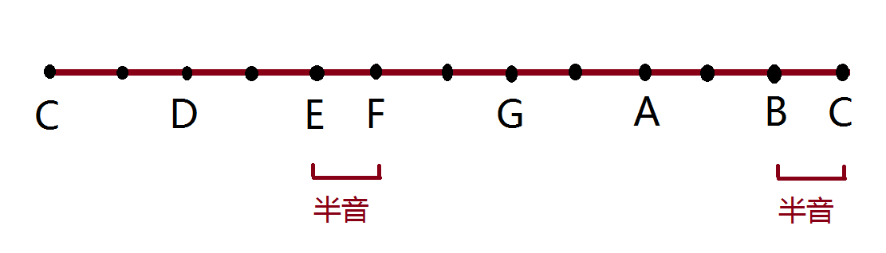

<!-- START doctoc generated TOC please keep comment here to allow auto update -->
<!-- DON'T EDIT THIS SECTION, INSTEAD RE-RUN doctoc TO UPDATE -->
**Table of Contents**  *generated with [DocToc](https://github.com/thlorenz/doctoc)*

- [简述](#%E7%AE%80%E8%BF%B0)
- [为什么要等比划分而不是等差？](#%E4%B8%BA%E4%BB%80%E4%B9%88%E8%A6%81%E7%AD%89%E6%AF%94%E5%88%92%E5%88%86%E8%80%8C%E4%B8%8D%E6%98%AF%E7%AD%89%E5%B7%AE)
- [半音与全音](#%E5%8D%8A%E9%9F%B3%E4%B8%8E%E5%85%A8%E9%9F%B3)
- [CDEFGAB 的排布](#cdefgab-%E7%9A%84%E6%8E%92%E5%B8%83)

<!-- END doctoc generated TOC please keep comment here to allow auto update -->

## 简述

十二平均律是学习乐理的基石。这种律法非常流行，现在极多数的乐曲是采用这种律制编成的。我们平时听到的大部分流行歌曲，也都是采用这种律制。

十二平均律，是将频率 `f（当前音域的某个音 A）` 到二倍频 `2f（高八度的对应音：高音A）` 的区域，划分成十二个频段，也就是有十三个频率点。要注意的是，这种划分并不是 **等差数列** 划分，而是等比数列划分。

**Tips：千万不要被平均两个字误导了，十二平均律不是 12 等分**

递推公式: `2^(1/12) = f(n+1)/fn`

频率计算公式： 

## 为什么要等比划分而不是等差？

但如果等差划分的话，`f1 / f2` 和 `f2 / f3` 就不相等了。而等比划分可以保证它们相等。这很重要，因为我们对复音的听觉感受，正是由两音的频率之比决定的，而不是两音的频率之差！

## 半音与全音

有些老师可能会这样告诉你什么是全音什么是半音：

```
半音：就是全音的一半
全音：两个半音组成的音
```

上面基本就等于没有解释；现在你可以精确的定义什么是半音与全音了:

我们将 C 这个音调调至 x 频率作为 C 调基准 1 (do)，则从 C 这个位置上升一个半音（#C）时的频率就是: `x * ( 2 ^ (1 / 12) ) `，全音（D）的话就是在半音（#C）基础上再次乘上：`2 ^ (1 / 12)`，也就是：`x * ( 2 ^ ( 2 / 12 ) )`，没有约分是方便理解发生了什么，后续升调同理继续乘就行了；

**重点：每个半音之间的频率差不相等，相等的是倍率，这倍率就是:`2^(1/12)`**

## CDEFGAB 的排布

平时使用的这音调就分布在十二音律的节点位置上



我们发现 E、F 和 B、C 的排布很特殊，他们之间并没有使用与其他音调一样的两个半音作为间隔，而是挨在了一起；
