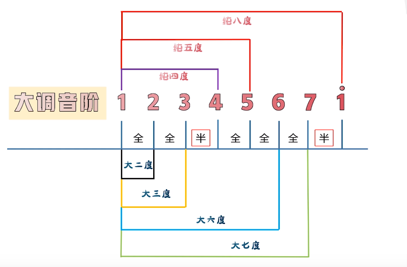
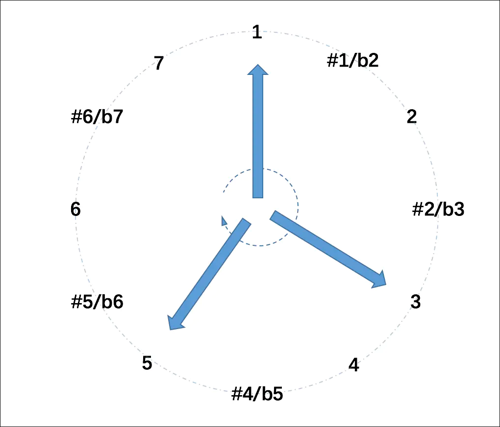

## 音程关系

音与音之间的音高距离表示为“音程”。

音程分两个描述块：形容词（大小增减纯）+名词构成（度）

n 个度就表示音高相差(n-1)个数字：1 => 3，他们相差两个数字，那么这个 n 就等于 3，因此这个名词就是 3 度；至于那个形容词，规则就比较复杂了，按照下面的规则进行：

- 纯（完全和谐）：纯一度（自己）、纯四度（5 个半音距离）、纯五度（7 个半音）、纯八度（12 个半音）
- 大：两个音之间相隔偶数个半音（一个八度内，超出一个八度就不叫这个名字了...）
- 小：两个音之间相隔奇数个半音
- 增：比大或者纯多一个半音
- 减：比小或者纯少一个半音

异名同音：同样的音程可以用不同的表示方法，叫法也就不一样，但是表示的都是同样的含义；比如：

```bash
C => E （大三度） 与 C => bF（减四度）音程是一样的
C => #D （增二度） 与 C => bE （小三度）
```

**Tips：为什么有纯这个麻烦的东西：自然音阶中 1458 这几个位置听起来最舒服，所以用纯来特殊标记（perfect），其他位置就不是那么好听，或者不好听，名字就不一样**



_Tips：1458 无大小，2367 没有纯_

### 音程环


